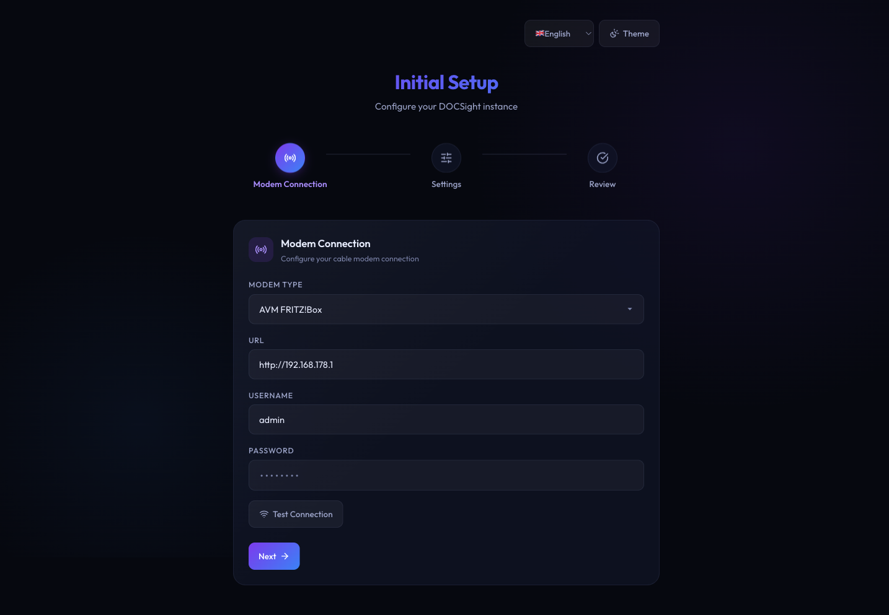

<p align="center">
  
</p>

<h1 align="center">DOCSight</h1>

<p align="center">
  <a href="LICENSE"></a>
  <a href="https://github.com/itsDNNS/docsight/pkgs/container/docsight"></a>
  <a href="https://github.com/itsDNNS/docsight"></a>
</p>

<p align="center">
  Docker container that monitors DOCSIS channel health on cable modems and publishes per-channel sensor data to Home Assistant via MQTT Auto-Discovery.
</p>


## Table of Contents

- [Features](#features)
- [Quick Start](#quick-start)
- [Configuration](#configuration)
- [Screenshots](#screenshots)
- [Created Sensors](#created-sensors)
- [Reference Values](#reference-values)
- [Requirements](#requirements)
- [Roadmap](#roadmap)
- [Contributing](#contributing)
- [Changelog](#changelog)

## Features

- **Web Dashboard**: Real-time channel data with health assessment, trend charts, and calendar navigation
- **Per-Channel Sensors**: Every downstream/upstream DOCSIS channel becomes its own Home Assistant sensor with full attributes
- **Summary Sensors**: Aggregated metrics (power min/max/avg, SNR, error counts, overall health)
- **Health Assessment**: Automatic traffic-light evaluation with actionable recommendations
- **Setup Wizard**: Browser-based configuration - no .env file needed
- **Settings Page**: Change all settings at runtime, test connections, toggle themes
- **Internationalization**: English, German, French, and Spanish UI
- **LLM Export**: Generate structured reports for AI analysis (ChatGPT, Claude, Gemini, etc.)
- **MQTT Auto-Discovery**: Zero-config integration with Home Assistant
- **ThinkBroadband BQM**: Daily fetch and archive of broadband quality graphs with gallery view
- **Optional Authentication**: Password-protected web UI with scrypt hashing
- **Light/Dark Mode**: Persistent theme toggle

## Quick Start

```bash
docker run -d --name docsight -p 8765:8765 -v docsight_data:/data ghcr.io/itsdnns/docsight:latest
```

Open `http://localhost:8765` - the setup wizard guides you through configuration.

For Docker Compose, Portainer, Dockhand, and detailed step-by-step instructions, see the **[Installation Guide](INSTALL.md)**.

<details>
<summary><h2>Configuration</h2></summary>

Configuration is stored in `config.json` inside the Docker volume and persists across restarts. Environment variables override config.json values.

### Via Web UI (recommended)

1. Start the container - the setup wizard opens automatically
2. Enter your modem URL, username, and password - test the connection
3. Optionally configure MQTT broker for Home Assistant integration
4. Set poll interval, history retention, and language
5. Done - monitoring starts immediately

Access `/settings` at any time to change configuration, set an admin password, or toggle light/dark mode.

### Via Environment Variables (optional)

Copy `.env.example` to `.env` and edit:

| Variable | Default | Description |
|---|---|---|
| `MODEM_URL` | `http://192.168.178.1` | Modem URL |
| `MODEM_USER` | - | Modem username |
| `MODEM_PASSWORD` | - | Modem password |
| `MQTT_HOST` | - | MQTT broker host (optional) |
| `MQTT_PORT` | `1883` | MQTT broker port |
| `MQTT_USER` | - | MQTT username (optional) |
| `MQTT_PASSWORD` | - | MQTT password (optional) |
| `MQTT_TOPIC_PREFIX` | `docsight` | MQTT topic prefix |
| `POLL_INTERVAL` | `900` | Polling interval in seconds |
| `WEB_PORT` | `8765` | Web UI port |
| `HISTORY_DAYS` | `0` | Snapshot retention in days (0 = unlimited) |
| `ADMIN_PASSWORD` | - | Web UI password (optional) |
| `BQM_URL` | - | ThinkBroadband BQM share URL (.png, optional) |

</details>

<details>
<summary><h2>Screenshots</h2></summary>

| Dashboard (Dark) | Dashboard (Light) | Setup Wizard |
|---|---|---|
|  |  |  |

| Trend Charts | Health Banner |
|---|---|
|  |  |

</details>

<details>
<summary><h2>Created Sensors</h2></summary>

### Per-Channel (~37 DS + 4 US)

- `sensor.docsight_ds_ch{id}` - State: Power (dBmV), Attributes: frequency, modulation, snr, errors, docsis_version, health
- `sensor.docsight_us_ch{id}` - State: Power (dBmV), Attributes: frequency, modulation, multiplex, docsis_version, health

### Summary (14)

| Sensor | Unit | Description |
|---|---|---|
| `docsight_health` | - | Overall health (good/marginal/poor) |
| `docsight_health_details` | - | Detail text |
| `docsight_ds_total` | - | Number of downstream channels |
| `docsight_ds_power_min/max/avg` | dBmV | Downstream power range |
| `docsight_ds_snr_min/avg` | dB | Downstream signal-to-noise |
| `docsight_ds_correctable_errors` | - | Total correctable errors |
| `docsight_ds_uncorrectable_errors` | - | Total uncorrectable errors |
| `docsight_us_total` | - | Number of upstream channels |
| `docsight_us_power_min/max/avg` | dBmV | Upstream power range |

</details>

<details>
<summary><h2>Reference Values</h2></summary>

| Metric | Good | Marginal | Poor |
|---|---|---|---|
| DS Power | -7..+7 dBmV | +/-7..+/-10 | > +/-10 dBmV |
| US Power | 35..49 dBmV | 50..54 | > 54 dBmV |
| SNR / MER | > 30 dB | 25..30 | < 25 dB |

</details>

## Requirements

- DOCSIS cable modem or router (tested with AVM FRITZ!Box 6690 Cable)
- MQTT broker (e.g., Mosquitto) - optional, for Home Assistant integration

## Roadmap

### Modulation & Signal Intelligence
- [ ] **Modulation Watchdog**: Track and alert on QAM modulation changes per channel (e.g. 256QAM dropping to 16QAM)
- [ ] **Channel Heatmap**: Visual grid of all channels color-coded by modulation quality — spot frequency-dependent issues at a glance
- [ ] **OFDMA Analysis**: Detect whether the modem uses a wide OFDMA block vs. many narrow SC-QAMs; flag subcarrier count fluctuations as potential ingress indicators
- [ ] **Adaptive Polling**: Automatically increase poll frequency (e.g. every 10-30s) when uncorrectable errors spike, to capture incidents in high resolution

### Diagnosis & Reporting
- [ ] **Incident Report Export**: One-click PDF/report with worst modulation values, max power levels, error sums, and auto-generated ISP complaint text referencing DIN thresholds
- [ ] **Ping Correlation**: Built-in latency monitor (ping to Google/Cloudflare) overlaid on error graphs to prove causality between physical layer issues and packet loss
- [ ] **Before/After Comparison**: Side-by-side overlay of two time periods (e.g. week before vs. after technician visit) to quantify improvements
- [ ] **FritzBox Event Log Parser**: Extract and display T3/T4 Timeout events, Ranging Request failures, and other DOCSIS error codes from the modem's event log

### External Monitoring Integration
- [x] **ThinkBroadband BQM**: Daily fetch and archive of external broadband quality graphs (latency, packet loss)
- [ ] **Speedtest Tracker**: Pull speed test results (download, upload, ping, jitter) from self-hosted [Speedtest Tracker](https://github.com/alexjustesen/speedtest-tracker)

### Enhanced Dashboard
- [ ] Combined timeline: DOCSIS health + speed tests + BQM graph on a single time axis
- [ ] Notification system: Webhooks on health degradation
- [ ] Mobile-responsive layout
- [ ] Power level drift detection: Alert on relative changes (e.g. +3 dB in 24h) in addition to absolute thresholds

### Multi-Modem Support
- [ ] Plugin architecture for modem drivers
- [ ] SNMP-based generic driver for additional cable modem models
- [ ] Community-contributed drivers (Arris, Technicolor, Sagemcom, etc.)

## Contributing

See [CONTRIBUTING.md](CONTRIBUTING.md) for development setup and guidelines.

## Changelog

See [CHANGELOG.md](CHANGELOG.md) for a detailed list of changes per version.

## License

[MIT](LICENSE)
