<p align="center">
  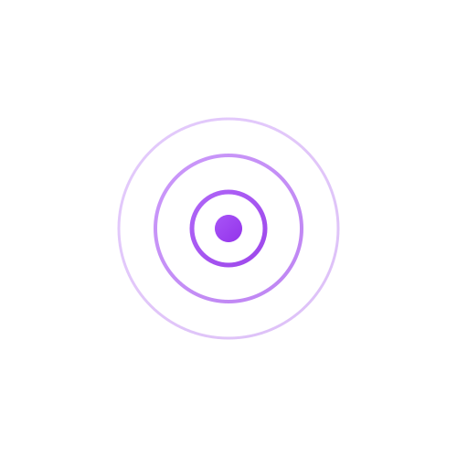
</p>

<h1 align="center">DOCSight</h1>

<p align="center">
  <a href="LICENSE"></a>
  <a href="https://github.com/itsDNNS/docsight/pkgs/container/docsight"></a>
  <a href="https://ko-fi.com/itsdnns"></a>
  <a href="https://github.com/itsDNNS/docsight/stargazers"></a>
</p>

<p align="center">
  <strong>Your cable internet is slow and your provider says everything is fine?<br>DOCSight proves them wrong.</strong>
</p>

<p align="center">
  DOCSight monitors your cable internet connection 24/7 and collects the hard evidence you need to hold your ISP accountable. One click generates a complaint letter with real data your provider can't ignore.
</p>

<p align="center">
  <em>For cable internet (DOCSIS/coax) only — Vodafone Kabel, Pyur, Tele Columbus, Virgin Media, Comcast, Spectrum, and others.</em>
</p>

<p align="center">
  <sub><strong>DOCSight</strong> = <strong>DOCS</strong>IS + In<strong>sight</strong> (+ a quiet <em>sigh</em> from every cable internet user)</sub>
</p>

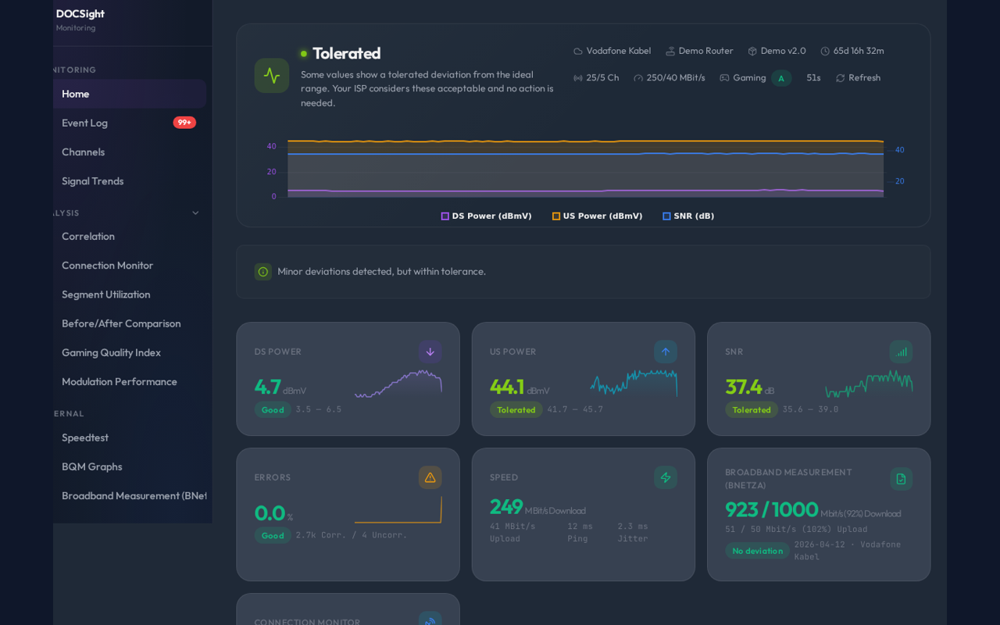

---

## Quick Start

```bash
docker run -d --name docsight -p 8765:8765 -v docsight_data:/data ghcr.io/itsdnns/docsight:latest
```

Open `http://localhost:8765`, enter your router login, done. [Full installation guide →](https://github.com/itsDNNS/docsight/wiki/Installation)

---

## 🎮 Demo Mode

Want to try DOCSight without a real router? Demo mode generates realistic DOCSIS data so you can explore the full dashboard, trends, event log, and incident journal.

```bash
docker run -d --name docsight-demo -p 8765:8765 -e DEMO_MODE=true ghcr.io/itsdnns/docsight:latest
```

Open `http://localhost:8765` — no setup required.

**What you get:**
- 25 downstream + 4 upstream channels with realistic signal values
- 90 days of historical data with diurnal and seasonal patterns
- Pre-populated event log and incident journal
- Full trend charts, channel timeline, and correlation analysis
- Works with MQTT (if configured)

---

## Is This For Me?

| | |
|---|---|
| ✅ You have **cable internet** (coax/DOCSIS) | DOCSight is built for this |
| ✅ Your internet **drops out or is slower** than what you're paying for | DOCSight documents it |
| ✅ Your ISP says **"everything is fine on our end"** | DOCSight gives you proof |
| ❌ You have **DSL or fiber** | This tool won't work for you |

---

## Your Data Stays With You

| | |
|---|---|
| 🏠 **Runs 100% locally** | No cloud, no external servers |
| 🔒 **Nothing leaves your network** | Your data is never uploaded anywhere |
| 📖 **Open source** | All code is public and verifiable |
| 🔐 **Credentials encrypted** | Router login encrypted at rest (AES-128) |

---

## Features

| Feature | Description |
|---|---|
| **[Live Dashboard](https://github.com/itsDNNS/docsight/wiki/Features-Dashboard)** | Real-time channel data with health assessment and metric cards |
| **[Signal Trends](https://github.com/itsDNNS/docsight/wiki/Features-Signal-Trends)** | Interactive charts with DOCSIS reference zones (day/week/month) |
| **[Correlation Analysis](https://github.com/itsDNNS/docsight/wiki/Features-Correlation-Analysis)** | Unified timeline combining signal, speedtest, and event data |
| **[Gaming Quality Index](https://github.com/itsDNNS/docsight/wiki/Features-Gaming-Quality)** | **NEW:** A-F grade for gaming readiness based on latency, jitter, and signal health |
| **[Event Log](https://github.com/itsDNNS/docsight/wiki/Features-Event-Log)** | Automatic anomaly detection with modulation watchdog |
| **[Speedtest Integration](https://github.com/itsDNNS/docsight/wiki/Features-Speedtest)** | Speed test history from [Speedtest Tracker](https://github.com/alexjustesen/speedtest-tracker) |
| **[Incident Journal](https://github.com/itsDNNS/docsight/wiki/Features-Incident-Journal)** | Document ISP issues with attachments |
| **[Complaint Generator](https://github.com/itsDNNS/docsight/wiki/Filing-a-Complaint)** | Editable ISP letter + downloadable technical PDF |
| **[Channel Timeline](https://github.com/itsDNNS/docsight/wiki/Features-Channel-Timeline)** | Per-channel power, SNR, error, and modulation history over time |
| **[Home Assistant](https://github.com/itsDNNS/docsight/wiki/Home-Assistant)** | MQTT Auto-Discovery with per-channel sensors |
| **[BQM Integration](https://github.com/itsDNNS/docsight/wiki/Features-BQM)** | ThinkBroadband broadband quality graphs |
| **[Smokeping Integration](https://github.com/itsDNNS/docsight/wiki/Features-Smokeping)** | Live latency graphs from your Smokeping instance |
| **[LLM Export](https://github.com/itsDNNS/docsight/wiki/Features-LLM-Export)** | Structured reports for AI analysis |
| **Demo Mode** | **NEW:** Try DOCSight without a router — 90 days of simulated data |

4 languages (EN/DE/FR/ES) · Light/Dark mode · Setup wizard · Optional authentication

---

## Screenshots

<details>
<summary>Click to expand</summary>

| Dashboard (Dark) | Dashboard (Light) |
|---|---|
|  | 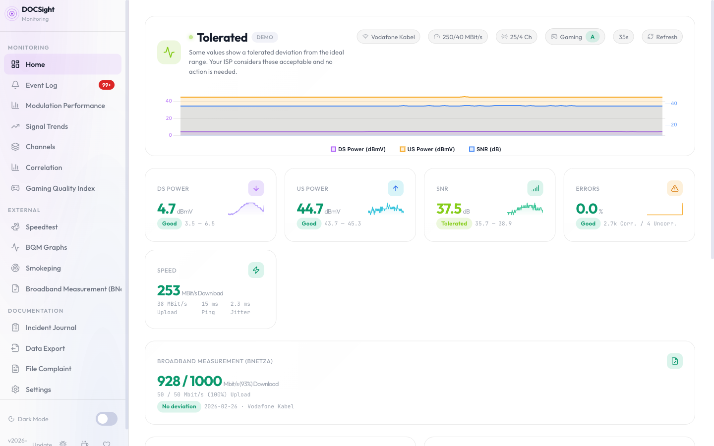 |

| Signal Trends | Health Assessment |
|---|---|
| 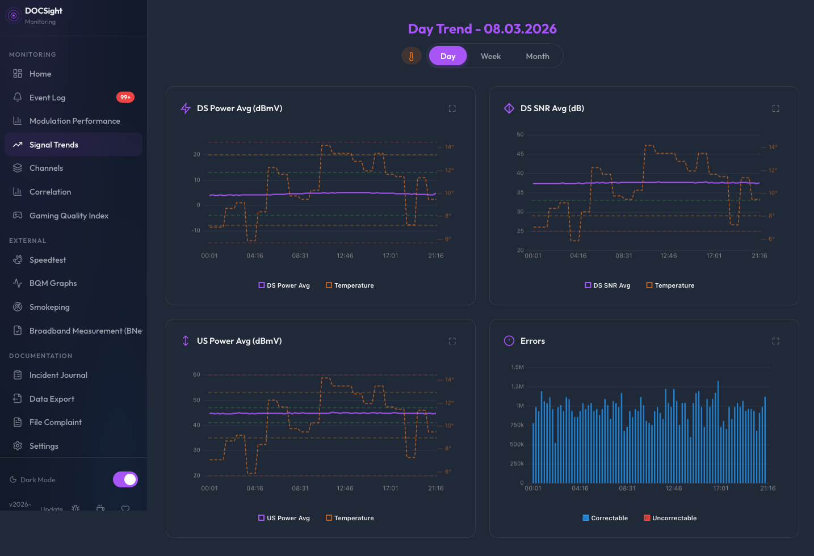 | 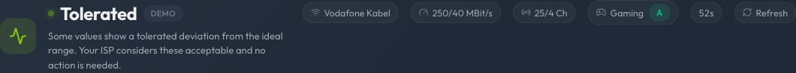 |

| Speedtest Tracker | Incident Journal |
|---|---|
| 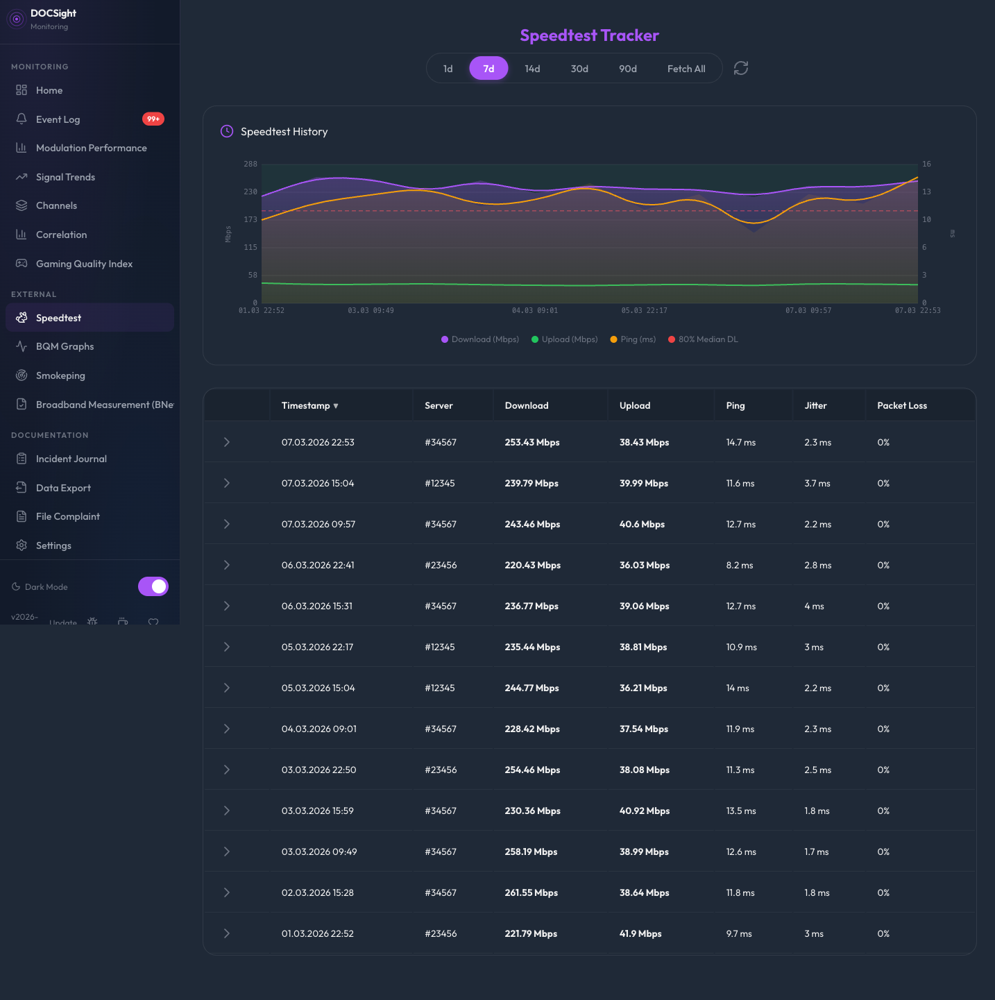 | 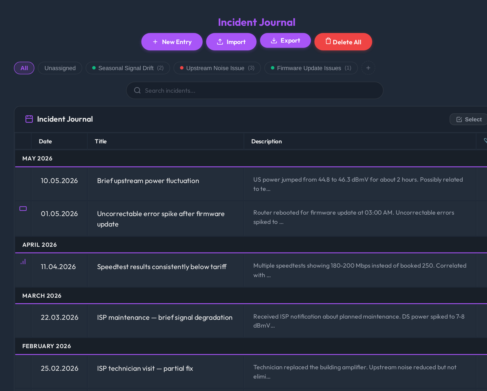 |

| Channel Timeline | Event Log |
|---|---|
| 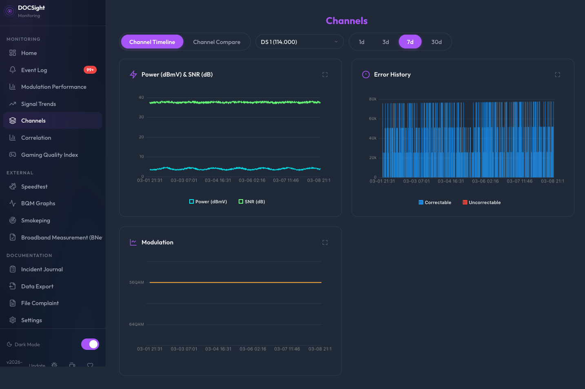 | 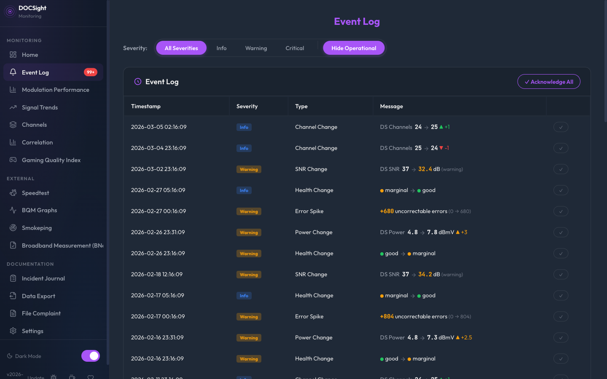 |

| Correlation Analysis (NEW) | Settings |
|---|---|
| 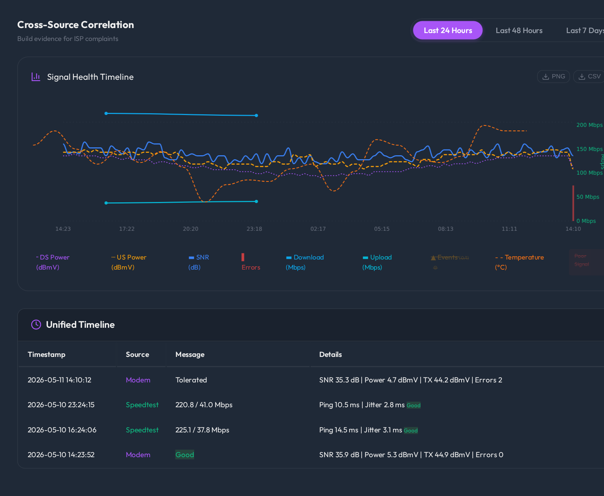 | 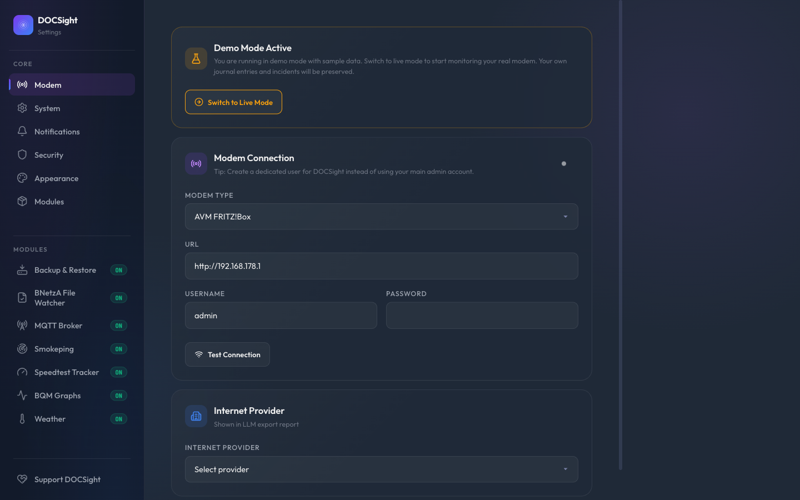 |

| BQM Integration | |
|---|---|
| 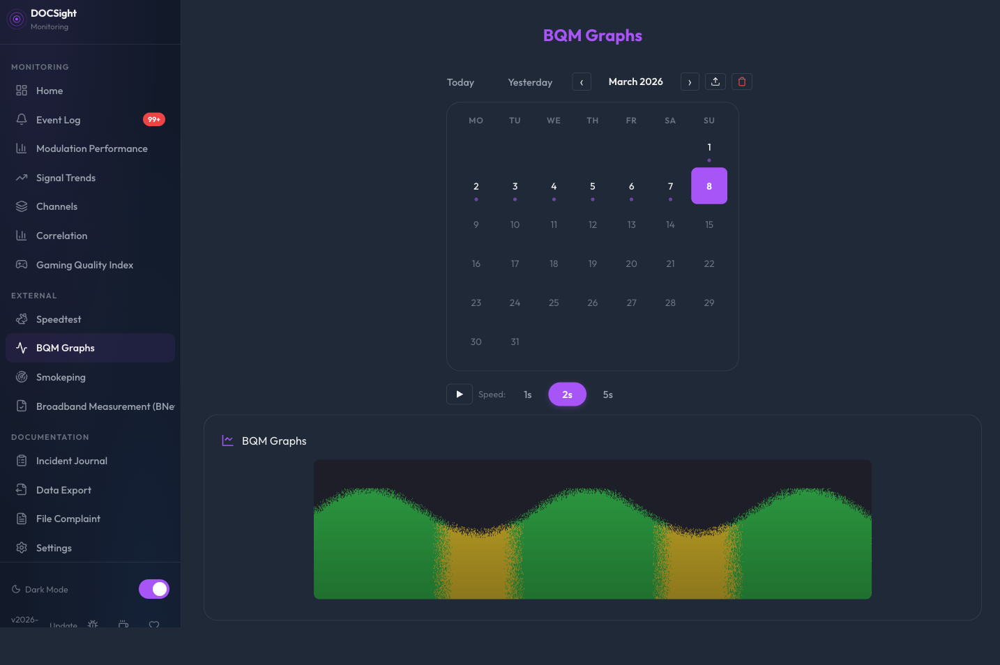 | |

</details>

---

## Supported Hardware

| | Status | Notes |
|---|---|---|
| **AVM Fritz!Box Cable** (6490, 6590, 6591, 6660, 6690) | ✅ Fully supported | |
| **Vodafone Station** (CGA4233, TG3442DE) | ✅ Fully supported | Bridge mode compatible |
| **Technicolor TC4400** | ✅ Fully supported | |
| **Vodafone Ultra Hub 7** (Sercomm) | ✅ Fully supported | |
| **Other DOCSIS modems** | Contributions welcome! See [Adding Modem Support](https://github.com/itsDNNS/docsight/wiki/Adding-Modem-Support) | |

Works with any DOCSIS cable provider: Vodafone, Pyur/Tele Columbus, eazy, Magenta (AT), UPC (CH), Virgin Media (UK), and others. Default signal thresholds are based on VFKD guidelines and can be customized in `thresholds.json` for your ISP.

---

## Architecture

DOCSight uses a **modular collector-based architecture** for reliable data gathering from multiple sources:

```
┌─────────────────────────────────────────────────────────────────────┐
│                       Collector Registry                              │
│  ┌──────────┐  ┌──────────┐  ┌──────────┐  ┌─────────┐  ┌──────────┐ │
│  │  Modem   │  │   Demo   │  │ Speedtest│  │   BQM   │  │Smokeping │ │
│  │ Collector│  │ Collector│  │ Collector│  │ Collect.│  │  (Proxy) │ │
│  └────┬─────┘  └────┬─────┘  └────┬─────┘  └────┬────┘  └────┬─────┘ │
│         │                  │                  │              │     │
│         ▼                  ▼                  ▼              ▼     │
│  ┌──────────────────────────────────────────────────────┐   │
│  │              Base Collector (Fail-Safe)              │   │
│  │  • Exponential backoff (30s → 3600s max)            │   │
│  │  • Auto-reset after 24h idle                        │   │
│  │  • Health status monitoring                         │   │
│  └──────────────────────────────────────────────────────┘   │
└─────────────────────────────────────────────────────────────────────┘
                          │
                          ▼
         ┌────────────────────────────────────┐
         │         Event Detector             │
         │  (Anomaly detection & alerting)    │
         └────────────┬───────────────────────┘
                      │
                      ▼
         ┌────────────────────────────────────┐
         │      SQLite Storage + MQTT          │
         │  (Snapshots, trends, Home Assistant)│
         └────────────┬───────────────────────┘
                      │
                      ▼
         ┌────────────────────────────────────┐
         │          Web UI (Flask)             │
         │  (Dashboard, charts, reports)       │
         └─────────────────────────────────────┘
```

### Key Design Principles

- **Modular collectors**: Each data source (modem, speedtest, BQM) is an independent collector with standardized interface
- **Built-in fail-safe**: Exponential backoff prevents hammering failing endpoints, with automatic recovery
- **Config-driven**: Collectors enable/disable based on configuration without code changes
- **Separation of concerns**: Data collection, analysis, storage, and presentation are cleanly separated
- **Extensible**: New data sources can be added by implementing the `Collector` base class

See [`ARCHITECTURE.md`](ARCHITECTURE.md) for detailed technical documentation.

---

## Requirements

- Docker (or any OCI-compatible container runtime)
- A supported DOCSIS cable modem or router (see above)
- MQTT broker (optional, for Home Assistant)

## Documentation

📚 **[Wiki](https://github.com/itsDNNS/docsight/wiki)** — Full documentation, guides, and DOCSIS glossary

## Contributing

See [CONTRIBUTING.md](CONTRIBUTING.md). **Please open an issue before working on new features.**

## Roadmap

**Released: [v2.0 — Complete Platform Redesign](https://github.com/itsDNNS/docsight/milestone/1)**

| Feature | Status | Issue |
|---|---|---|
| Unified Collector Architecture | ✅ Released | [#23](https://github.com/itsDNNS/docsight/issues/23) |
| Modern UI Redesign | ✅ Released | — |
| Cross-Source Correlation | ✅ Released | — |
| FritzBox Event Log Integration | ✅ Released | [#17](https://github.com/itsDNNS/docsight/issues/17) |
| OFDMA Channel Analysis | ✅ Released | [#18](https://github.com/itsDNNS/docsight/issues/18) |
| Gaming Quality Index | ✅ Released | [#20](https://github.com/itsDNNS/docsight/issues/20) |
| Modulation Watchdog & Power Drift | ✅ Released | [#21](https://github.com/itsDNNS/docsight/issues/21) |
| Demo/Test Mode | ✅ Released | [#30](https://github.com/itsDNNS/docsight/issues/30) |
| Smokeping Integration | ✅ Released | [#22](https://github.com/itsDNNS/docsight/issues/22) |
| Vodafone Station Support | ✅ Released | [#14](https://github.com/itsDNNS/docsight/issues/14) |
| Technicolor TC4400 Support | ✅ Released | [#24](https://github.com/itsDNNS/docsight/issues/24) |
| Vodafone Ultra Hub 7 Support | ✅ Released | [#29](https://github.com/itsDNNS/docsight/issues/29) |

**Planned:**

| Feature | Issue |
|---|---|
| Notification System | [#19](https://github.com/itsDNNS/docsight/issues/19) |
| Before/After Comparison | [#50](https://github.com/itsDNNS/docsight/issues/50) |

See the **[full roadmap](https://github.com/itsDNNS/docsight/wiki/Roadmap)** in the wiki for long-term goals and modem support plans.

## Changelog

See [GitHub Releases](https://github.com/itsDNNS/docsight/releases).

## Support

If DOCSight helps you, consider [buying me a coffee](https://ko-fi.com/itsdnns) ☕

## License

[MIT](LICENSE)
