<p align="center">
  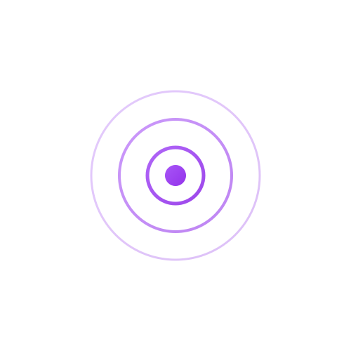
</p>

<h1 align="center">DOCSight</h1>

<p align="center">
  <a href="LICENSE"></a>
  <a href="https://github.com/itsDNNS/docsight/pkgs/container/docsight"></a>
  <a href="https://github.com/itsDNNS/docsight/stargazers"></a>
  <a href="https://github.com/itsDNNS/docsight/pkgs/container/docsight"></a>
  <a href="https://selfh.st/weekly/2026-02-27/"></a>
</p>

<p align="center">
  <strong>Your ISP says everything is fine. DOCSight gives you the proof that it isn't.</strong>
</p>

<p align="center">
  DOCSight continuously monitors your connection, catches the issues your ISP misses in one-off snapshots, and builds a timestamped evidence trail you can use, from live diagnostics and trend charts to incident reports and complaint-ready exports.
</p>

<p align="center">
  Available in 🇬🇧 🇩🇪 🇪🇸 🇫🇷
</p>

<p align="center">
  <strong>Self-hosted</strong> • <strong>Demo mode</strong> • <strong>Complaint-ready exports</strong> • <strong>16 modem families</strong> • <strong>Home Assistant + MQTT</strong> • <strong>4 languages</strong> • <strong>MIT licensed</strong>
</p>

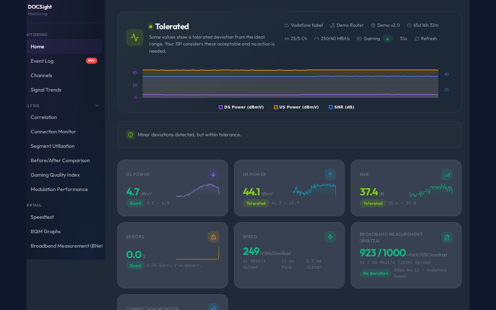

---

## Get Started

### Option 1: Try the demo

No router required. Demo mode generates 9 months of realistic DOCSIS data so you can explore everything immediately.

```bash
docker run -d --name docsight-demo -p 8765:8765 -e DEMO_MODE=true ghcr.io/itsdnns/docsight:latest
```

### Option 2: Connect your own router

```bash
docker run -d --name docsight -p 8765:8765 -v docsight_data:/data ghcr.io/itsdnns/docsight:latest
```

Open `http://localhost:8765`, then either explore the demo or connect your router in the setup wizard.

[Full installation guide](https://github.com/itsDNNS/docsight/wiki/Installation) | [Example Compose Stacks](https://github.com/itsDNNS/docsight/wiki/Example-Compose-Stacks)

---

## From Suspicion to Evidence

Most connection problems aren't one-time events. They come and go, making them nearly impossible to prove when you call your ISP.

DOCSight runs in the background and builds your case over time:

- **Hour 1:** You see your current signal health and any active issues
- **Week 1:** Trend charts reveal patterns your ISP can't see from a single snapshot
- **Month 1:** The event log, incident journal, and correlation analysis paint a complete picture
- **When you call your ISP:** DOCSight turns weeks of evidence into reports, exports, and complaint-ready documentation

The longer DOCSight runs, the stronger your evidence gets.

---

## What DOCSight Does

<table>
<tr>
<td width="33%" valign="top">

**Monitor**

Continuously captures signal health, latency, outages, and speed so transient problems don't disappear before you can prove them.

</td>
<td width="33%" valign="top">

**Document**

Builds a timestamped evidence trail with trend charts, anomaly history, incident logs, and before/after comparisons.

</td>
<td width="33%" valign="top">

**Act**

Turns raw diagnostics into reports and complaint-ready exports you can send to your ISP.

</td>
</tr>
</table>

---

## Best Fit For

### People who keep getting dismissed by their ISP

DOCSight is a strong fit if your connection drops out, slows down, or behaves inconsistently and you need more than a one-time screenshot.

- prove recurring problems over days and weeks instead of a single bad moment
- keep an incident history with your own notes and attachments
- compare before and after a technician visit, modem swap, or ISP claim
- turn raw monitoring into exports and complaint-ready documentation

### Self-hosters who want proof, not just pretty charts

DOCSight is also a strong fit if you want something that:

- runs locally on your own hardware with no cloud dependency
- supports real DOCSIS cable signal monitoring instead of generic uptime checks only
- integrates with Home Assistant, MQTT, and external measurement sources
- is documented deeply enough that you can inspect, extend, and actually trust it

---

## Start in the Way That Fits You

- **Want to see the product first?** Start with the [demo](#option-1-try-the-demo) and explore 9 months of realistic DOCSIS data instantly.
- **Want it running fast on your own hardware?** Use [Get Started](#get-started) and then follow the [full installation guide](https://github.com/itsDNNS/docsight/wiki/Installation).
- **Want to confirm your hardware path first?** Jump to [Supported Hardware](#supported-hardware).
- **Want to inspect the architecture before you trust it?** Read [ARCHITECTURE.md](ARCHITECTURE.md).
- **Want versioned builds and release notes?** Check [GitHub Releases](https://github.com/itsDNNS/docsight/releases).

---

## Is This For Me?

| | |
|---|---|
| ✅ You have **cable internet** (coax/DOCSIS) | DOCSight is built for this, with full signal monitoring |
| ✅ You have **fiber, DSL, or satellite** | Generic Router mode still gives you speed tracking, latency monitoring, incident logging, evidence reports, and modules |
| ✅ Your internet **drops out or is slower** than what you're paying for | DOCSight documents it over time |
| ✅ Your ISP says **"everything is fine on our end"** | DOCSight gives you the data to push back with confidence |

---

## Your Data Stays With You

| | |
|---|---|
| 🏠 **Runs 100% locally** | Your monitoring stays on your own hardware |
| 🔒 **Nothing leaves your network** | Signal history, incident timelines, and reports are never uploaded to a cloud service |
| 📖 **Open source** | All code is public and verifiable |
| 🔐 **Credentials encrypted** | Router login encrypted at rest (AES-128) |

---

## Features

DOCSight is built around an evidence-first workflow, then extended with deeper analysis and integrations.

### Core Evidence Workflow

| Feature | Why it matters |
|---|---|
| **[Live Dashboard](https://github.com/itsDNNS/docsight/wiki/Features-Dashboard)** | See current signal health, active issues, and actionable diagnostics at a glance |
| **[Signal Trends](https://github.com/itsDNNS/docsight/wiki/Features-Signal-Trends)** | Turn intermittent instability into visible long-term patterns |
| **[Connection Monitor](https://github.com/itsDNNS/docsight/wiki/Features-Connection-Monitor)** | Track latency, packet loss, outages, and traceroute evidence continuously |
| **[Event Log](https://github.com/itsDNNS/docsight/wiki/Features-Event-Log)** | Automatically record anomalies like modulation drops and modem restarts |
| **[Incident Journal](https://github.com/itsDNNS/docsight/wiki/Features-Incident-Journal)** | Add your own notes, imports, attachments, and incident groupings |
| **[Before/After Comparison](https://github.com/itsDNNS/docsight/wiki/Features-Before-After-Comparison)** | Show whether a technician visit or ISP change actually improved anything |
| **[Correlation Analysis](https://github.com/itsDNNS/docsight/wiki/Features-Correlation-Analysis)** | Combine signal, speed, and event history in one timeline |
| **[Complaint Generator](https://github.com/itsDNNS/docsight/wiki/Filing-a-Complaint)** | Turn your evidence trail into ISP-ready letters and technical PDFs |

### Analysis, Integrations, and Power Features

| Category | Includes |
|---|---|
| **Network analysis** | [Gaming Quality Index](https://github.com/itsDNNS/docsight/wiki/Features-Gaming-Quality), [Modulation Performance](https://github.com/itsDNNS/docsight/wiki/Features-Modulation-Performance), [Channel Timeline](https://github.com/itsDNNS/docsight/wiki/Features-Channel-Timeline), [Cable Segment Utilization](https://github.com/itsDNNS/docsight/wiki/Features-Segment-Utilization) |
| **External data sources** | [Speedtest Integration](https://github.com/itsDNNS/docsight/wiki/Features-Speedtest), [Smart Capture](https://github.com/itsDNNS/docsight/wiki/Features-Smart-Capture), [BNetzA Measurements](https://github.com/itsDNNS/docsight/wiki/Features-BNetzA), [BQM Integration](https://github.com/itsDNNS/docsight/wiki/Features-BQM), [Smokeping Integration](https://github.com/itsDNNS/docsight/wiki/Features-Smokeping) |
| **Platform features** | [Home Assistant](https://github.com/itsDNNS/docsight/wiki/Home-Assistant), [Backup & Restore](https://github.com/itsDNNS/docsight/wiki/Backup-and-Restore), notifications, setup wizard, optional authentication, API tokens |
| **Usability and extensibility** | [Demo Mode](https://github.com/itsDNNS/docsight/wiki/Features-Demo-Mode), [Theme Engine](https://github.com/itsDNNS/docsight/wiki/Themes), [Community Modules](https://github.com/itsDNNS/docsight-modules), [In-App Glossary](https://github.com/itsDNNS/docsight/wiki/Features-Glossary), [LLM Export](https://github.com/itsDNNS/docsight/wiki/Features-LLM-Export) |

Also includes 4 languages (EN/DE/FR/ES), light/dark mode, PWA/offline support, and a system font toggle.

---

## Screenshots

A few highlights from the interface:

| Dashboard | Signal Trends |
|---|---|
|  | 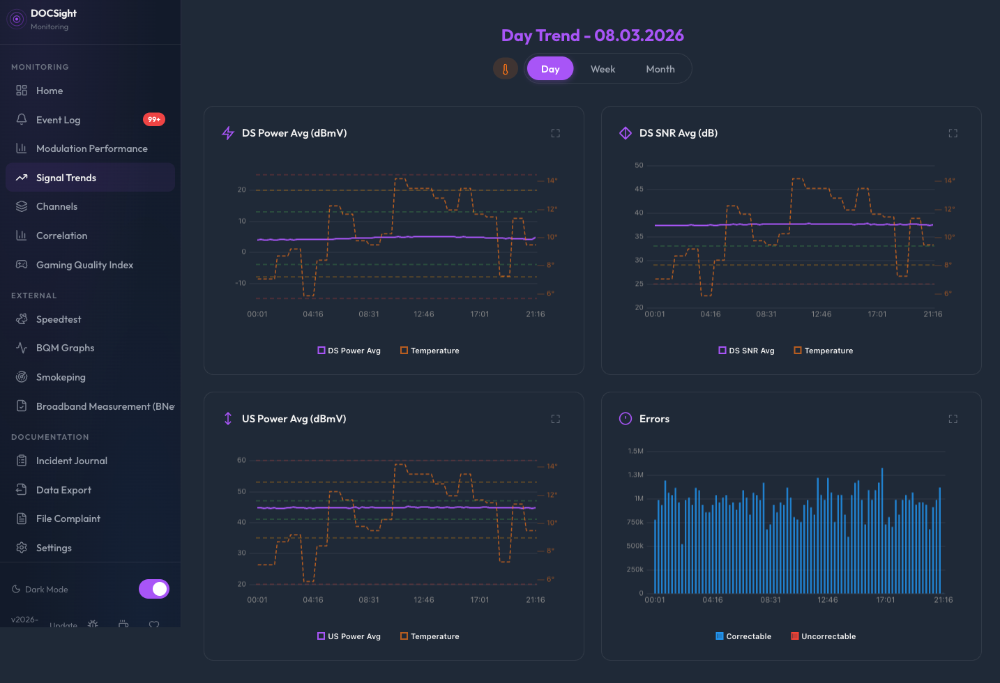 |

| Incident Journal | Complaint Workflow |
|---|---|
| 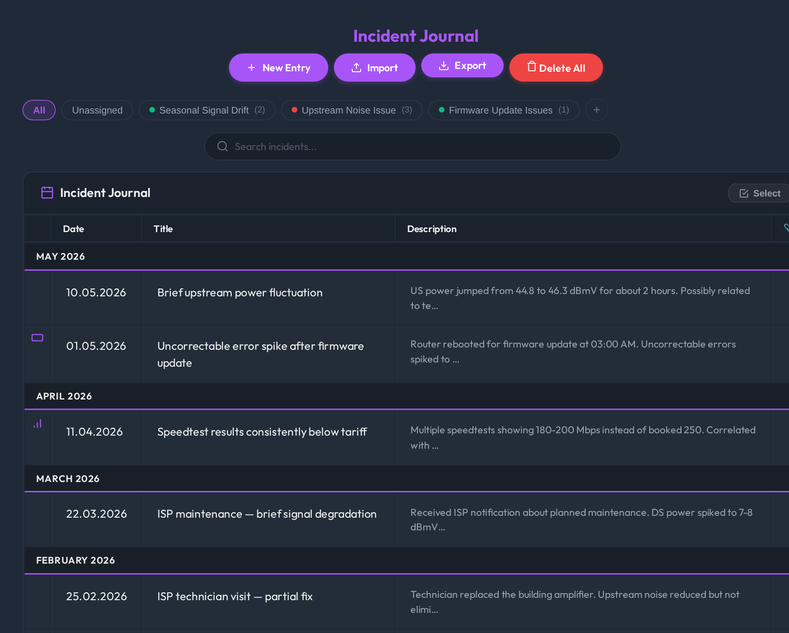 | 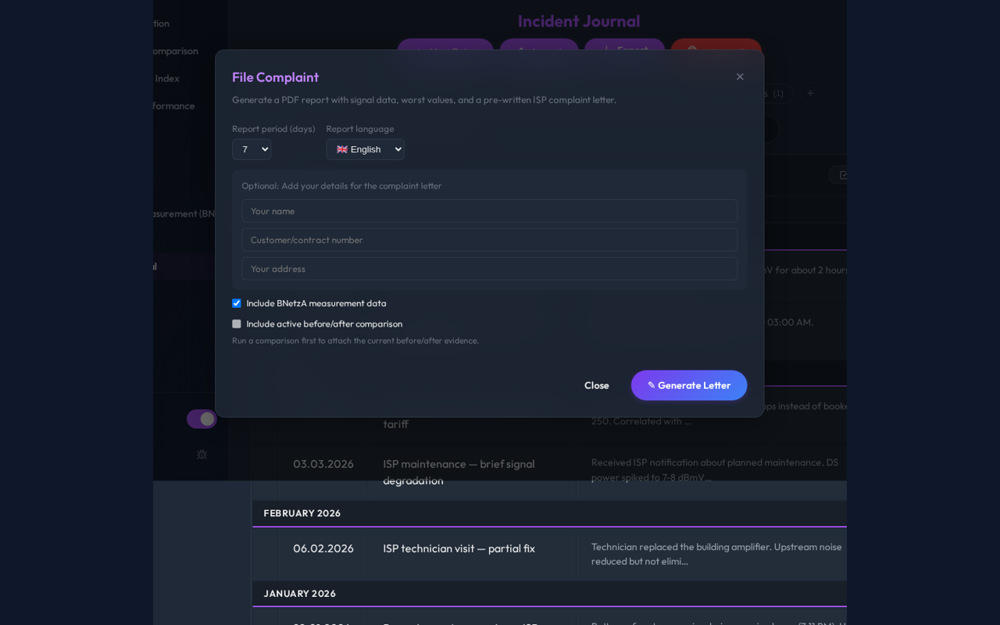 |

<details>
<summary>See the extended screenshot gallery</summary>

| Dashboard (Light) | Health Assessment |
|---|---|
| 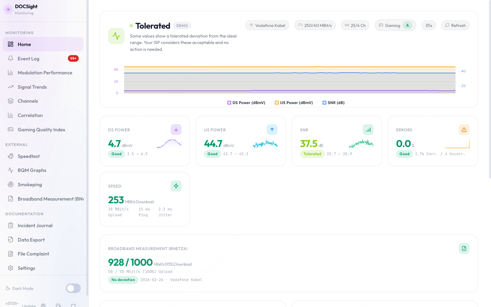 | 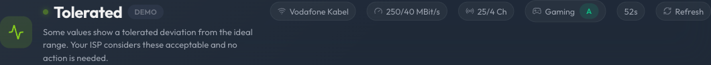 |

| Speedtest Tracker | Import (Excel/CSV) |
|---|---|
| 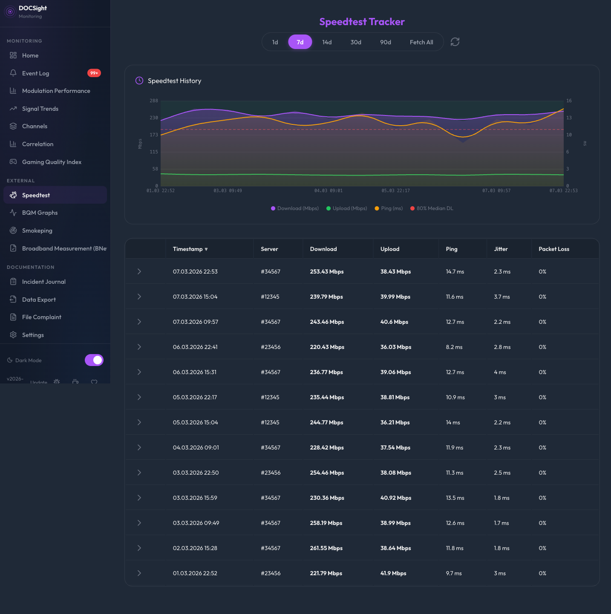 | 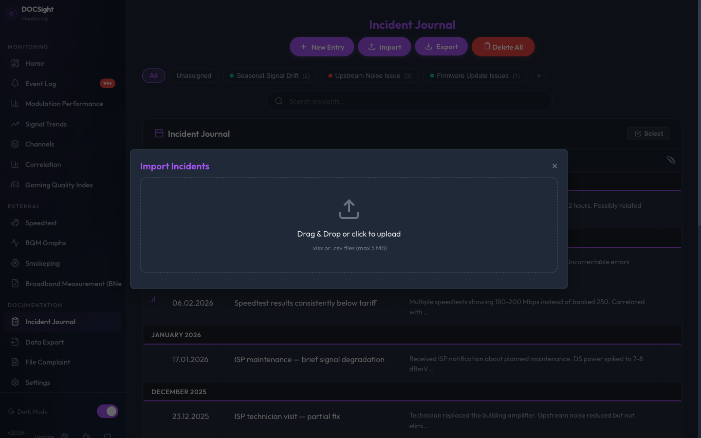 |

| Edit with Icon Picker | Channel Timeline |
|---|---|
| 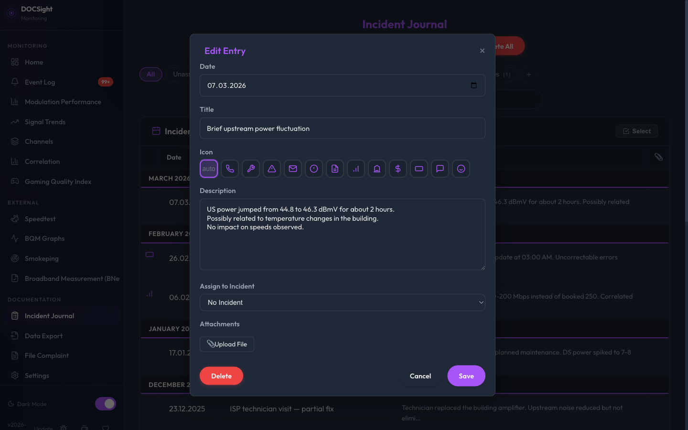 | 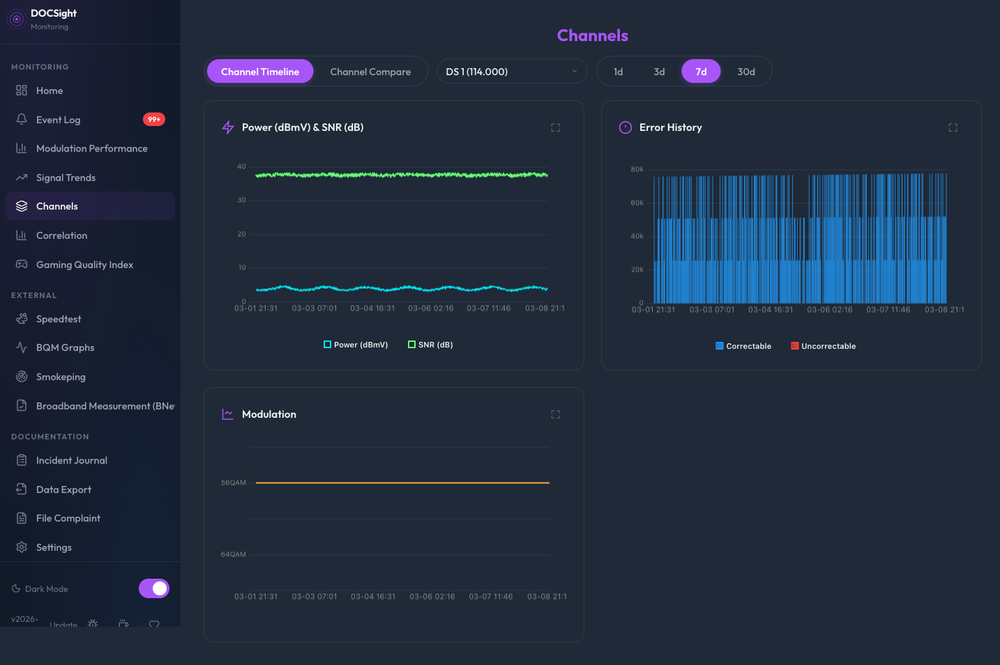 |

| Event Log | Settings |
|---|---|
| 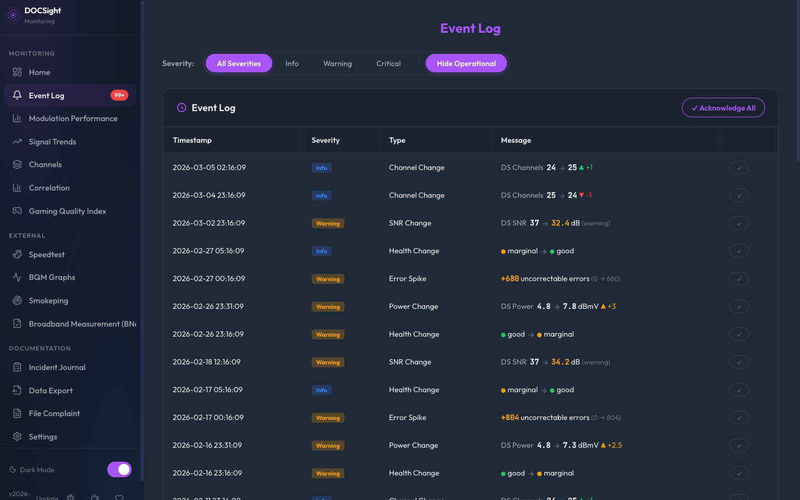 | 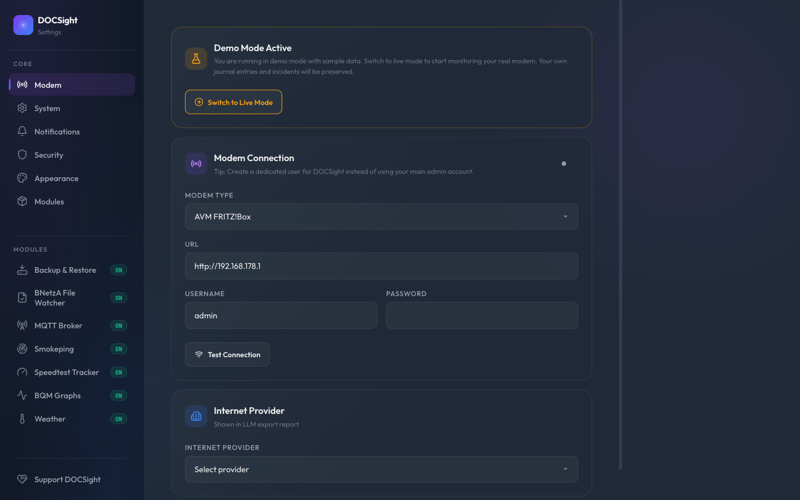 |

| Theme Gallery | BQM Integration |
|---|---|
| 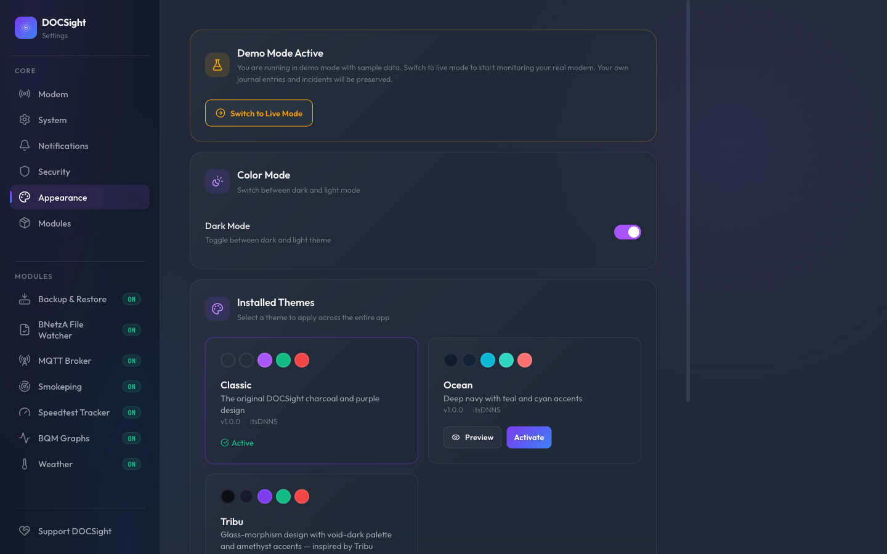 | 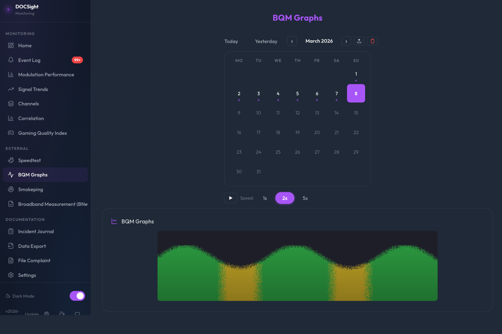 |

</details>

---

## Supported Hardware

DOCSight supports **16 modem families** out of the box and also offers **Generic Router mode** for fiber, DSL, and satellite connections.

### Common setups

- **Vodafone Station** (CGA4233, TG3442DE): bridge mode compatible
- **AVM FRITZ!Box Cable** (6490, 6590, 6591, 6660, 6690)
- **Vodafone Ultra Hub 7** (Sercomm)
- **Unitymedia Connect Box** (CH7465)
- **Sagemcom F@st 3896:** JSON-RPC API
- **Technicolor TC4400**
- **Arris SURFboard** (S33, S34, SB8200): HNAP1 API
- **Hitron CODA-56**
- **Netgear CM3000**
- **Generic Router mode:** no DOCSIS signal pages, but still supports speed tracking, latency monitoring, incident logging, reports, and modules

[See the full compatibility and setup docs in the wiki →](https://github.com/itsDNNS/docsight/wiki)

DOCSight works with DOCSIS cable providers worldwide. Community drivers and extensions live in [docsight-modules](https://github.com/itsDNNS/docsight-modules), and you can also [add your own modem support](https://github.com/itsDNNS/docsight/wiki/Adding-Modem-Support).

> **Currently focused on the German cable market** for complaint templates, BNetzA measurements, and VFKD thresholds. The core monitoring stack is usable beyond Germany, and community contributions for other markets are welcome.

---

## Architecture

DOCSight uses a **modular collector-based architecture** for reliable data gathering from multiple sources:

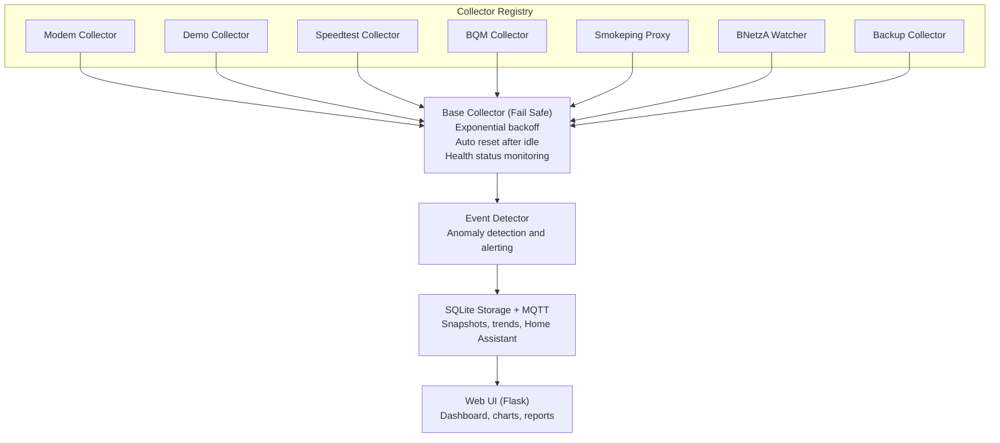
```mermaid
flowchart TD
    subgraph CR["Collector Registry"]
        MC["Modem Collector"]
        DC["Demo Collector"]
        SC["Speedtest Collector"]
        BC["BQM Collector"]
        SP["Smokeping Proxy"]
        BN["BNetzA Watcher"]
        BK["Backup Collector"]
    end

    MC --> BASE
    DC --> BASE
    SC --> BASE
    BC --> BASE
    SP --> BASE
    BN --> BASE
    BK --> BASE

    BASE["Base Collector (Fail Safe)<br/>Exponential backoff<br/>Auto reset after idle<br/>Health status monitoring"]
    BASE --> EVT["Event Detector<br/>Anomaly detection and alerting"]
    EVT --> STORE["SQLite Storage + MQTT<br/>Snapshots, trends, Home Assistant"]
    STORE --> UI["Web UI (Flask)<br/>Dashboard, charts, reports"]
```

Architecture layers:

- `Collectors`: modem, demo, speedtest, BQM, Smokeping, BNetzA, and backup inputs
- `Base Collector`: shared fail-safe behavior like backoff, reset, and health handling
- `Event Detector`: turns raw state changes into anomaly and alert events
- `Storage + MQTT`: persists snapshots and exposes data to Home Assistant
- `Web UI`: presents dashboards, trends, reports, and complaint workflows

See [`ARCHITECTURE.md`](ARCHITECTURE.md) for detailed technical documentation.

---

## Requirements

- Docker (or any OCI-compatible container runtime), or see [Running without Docker](https://github.com/itsDNNS/docsight/wiki/Running-without-Docker) for a native Python setup
- A supported DOCSIS cable modem/router (see above), or any router via Generic Router mode
- MQTT broker (optional, for Home Assistant)

## Community and Support

Use the right channel so questions, bug reports, modem requests, and real-world examples do not get mixed together.

| Need | Best place |
| --- | --- |
| Setup help and troubleshooting | [GitHub Discussions: Q&A](https://github.com/itsDNNS/docsight/discussions/categories/q-a) |
| Feature ideas and roadmap feedback | [GitHub Discussions: Ideas](https://github.com/itsDNNS/docsight/discussions/categories/ideas) |
| Share your setup, exports, or evidence workflow | [GitHub Discussions: Show and tell](https://github.com/itsDNNS/docsight/discussions/categories/show-and-tell) |
| Confirmed bugs and regressions | [Bug report issue form](https://github.com/itsDNNS/docsight/issues/new?template=bug_report.yml) |
| Documentation gaps or stale screenshots | [Documentation improvement form](https://github.com/itsDNNS/docsight/issues/new?template=documentation.yml) |
| New modem support requests | [Modem support request form](https://github.com/itsDNNS/docsight/issues/new?template=modem_support.yml) |
| Security vulnerabilities | [Private security advisory](https://github.com/itsDNNS/docsight/security/advisories/new) |

For the full routing guide, see [SUPPORT.md](SUPPORT.md).

## Contributing

See [CONTRIBUTING.md](CONTRIBUTING.md). **Please open an issue or start an Ideas discussion before working on new features.**

## Roadmap

See the **[full roadmap](https://github.com/itsDNNS/docsight/wiki/Roadmap)** in the wiki for long-term goals and modem support plans.

## Changelog

See [GitHub Releases](https://github.com/itsDNNS/docsight/releases).

## Support

If DOCSight helped you prove an issue, understand your connection better, or save time with your ISP, consider supporting development:

<a href="https://github.com/sponsors/itsDNNS"></a>
<a href="https://ko-fi.com/itsdnns"></a>
<a href="https://paypal.me/itsDNNS"></a>

DOCSight is actively maintained and tested against real hardware. Support helps fund development time, hardware access, documentation, testing, and long-term maintenance.

## Brand Use

The code is MIT-licensed, but the `DOCSight` name, logo, and project branding are governed separately. Community forks and commercial services may say they are "based on DOCSight" or "compatible with DOCSight", but must not present themselves as the official project without permission.

See [TRADEMARKS.md](TRADEMARKS.md) for the full brand and trademark policy.

## Documentation

| Document | Scope |
|---|---|
| [Wiki](https://github.com/itsDNNS/docsight/wiki) | User guides, feature docs, setup instructions |
| [GitHub Releases](https://github.com/itsDNNS/docsight/releases) | Versioned builds and release notes |
| [SUPPORT.md](SUPPORT.md) | Support routing, community channels, and issue guidance |
| [ARCHITECTURE.md](ARCHITECTURE.md) | Technical architecture and extension guide |
| [CONTRIBUTING.md](CONTRIBUTING.md) | Development and contribution guidelines |
| [TRADEMARKS.md](TRADEMARKS.md) | Brand, logo, and official-use policy |

## License

[MIT](LICENSE)

<p align="center">
  <sub><strong>DOCSight</strong> = <strong>DOCS</strong>IS + In<strong>sight</strong> (+ a quiet <em>sigh</em> from every cable internet user)</sub>
</p>
