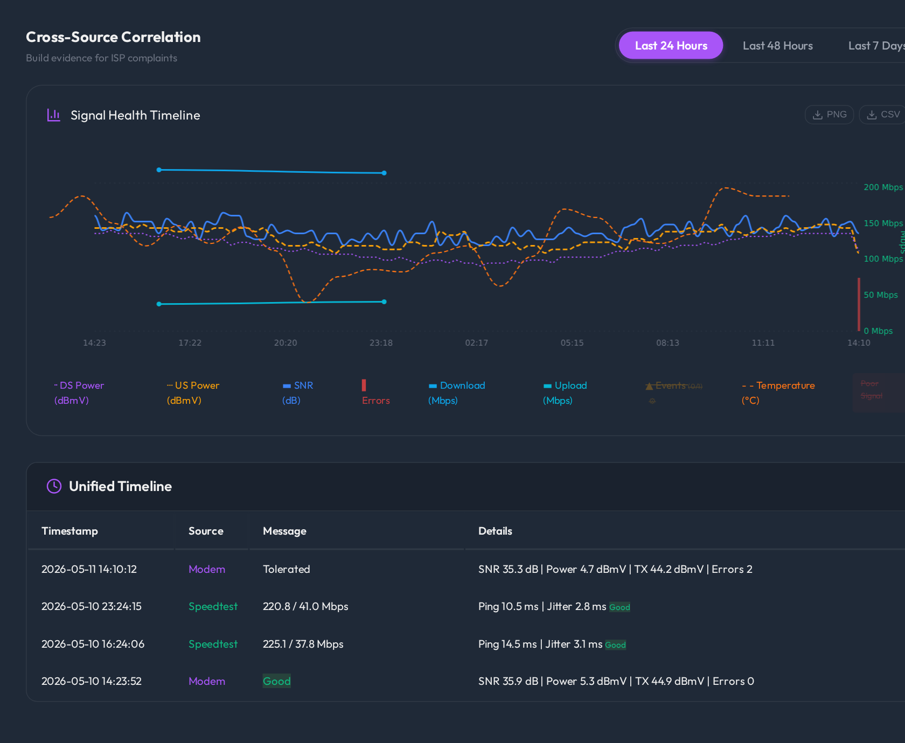
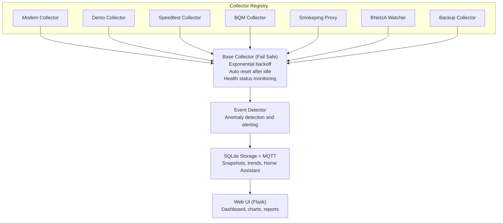

<p align="center">
  
</p>

<h1 align="center">DOCSight</h1>

<p align="center">
  <a href="LICENSE"></a>
  <a href="https://github.com/itsDNNS/docsight/pkgs/container/docsight"></a>
  <a href="https://github.com/itsDNNS/docsight/stargazers"></a>
  <a href="https://github.com/itsDNNS/docsight/pkgs/container/docsight"></a>
  <a href="https://selfh.st/weekly/2026-02-27/"></a>
</p>

<p align="center">
  <strong>Your ISP says everything is fine. DOCSight gives you the proof that it isn't.</strong>
</p>

<p align="center">
  DOCSight monitors your cable internet 24/7, documents every signal issue, and generates complaint letters with hard evidence your provider can't dismiss.
</p>

<p align="center">
  Available in 🇬🇧 🇩🇪 🇪🇸 🇫🇷
</p>


---

## Try It Now

No router needed. Demo mode generates 9 months of realistic DOCSIS data so you can explore everything.

```bash
docker run -d --name docsight-demo -p 8765:8765 -e DEMO_MODE=true ghcr.io/itsdnns/docsight:latest
```

Open `http://localhost:8765` and see what DOCSight can do.

---

## What DOCSight Does

<table>
<tr>
<td width="33%" valign="top">

**Monitor**

Tracks every DOCSIS signal metric around the clock: downstream power, upstream power, SNR, modulation, error rates, latency, and speed. Detects anomalies automatically.

</td>
<td width="33%" valign="top">

**Document**

Builds a timeline of evidence: signal trends, event log, incident journal, before/after comparisons, correlation analysis. Every issue is recorded with timestamps and data.

</td>
<td width="33%" valign="top">

**Act**

Generates ISP complaint letters backed by real measurements. One click creates a technical PDF with diagnostic data your provider has to take seriously.

</td>
</tr>
</table>

---

## Quick Start

```bash
docker run -d --name docsight -p 8765:8765 -v docsight_data:/data ghcr.io/itsdnns/docsight:latest
```

Open `http://localhost:8765`, enter your router login, done.

[Full installation guide](https://github.com/itsDNNS/docsight/wiki/Installation) | [Example Compose Stacks](https://github.com/itsDNNS/docsight/wiki/Example-Compose-Stacks)

---

## From Suspicion to Evidence

Most connection problems aren't one-time events. They come and go, making them nearly impossible to prove when you call your ISP.

DOCSight runs in the background and builds your case over time:

- **Hour 1** - You see your current signal health and any active issues
- **Week 1** - Trend charts reveal patterns your ISP can't see from a single snapshot
- **Month 1** - The event log, incident journal, and correlation analysis paint a complete picture
- **When you call your ISP** - The complaint generator turns weeks of evidence into a professional letter with attached diagnostics

The longer DOCSight runs, the stronger your evidence gets.

---

## Is This For Me?

| | |
|---|---|
| ✅ You have **cable internet** (coax/DOCSIS) | DOCSight is built for this - full signal monitoring |
| ✅ You have **fiber, DSL, or satellite** | Generic Router mode gives you speedtest tracking, incident journal, and more |
| ✅ Your internet **drops out or is slower** than what you're paying for | DOCSight documents it |
| ✅ Your ISP says **"everything is fine on our end"** | DOCSight gives you proof |

---

## Your Data Stays With You

| | |
|---|---|
| 🏠 **Runs 100% locally** | No cloud, no external servers |
| 🔒 **Nothing leaves your network** | Your data is never uploaded anywhere |
| 📖 **Open source** | All code is public and verifiable |
| 🔐 **Credentials encrypted** | Router login encrypted at rest (AES-128) |

---

## Features

### Core Evidence Workflow

| Feature | Description |
|---|---|
| **[Live Dashboard](https://github.com/itsDNNS/docsight/wiki/Features-Dashboard)** | Real-time channel data with health assessment, actionable insights, and expandable channel details |
| **[Signal Trends](https://github.com/itsDNNS/docsight/wiki/Features-Signal-Trends)** | Interactive charts with DOCSIS reference zones (day/week/month) |
| **[Before/After Comparison](https://github.com/itsDNNS/docsight/wiki/Features-Before-After-Comparison)** | Compare two time periods side by side with presets, delta summaries, and complaint-ready evidence |
| **[Correlation Analysis](https://github.com/itsDNNS/docsight/wiki/Features-Correlation-Analysis)** | Unified timeline combining signal, speedtest, and event data |
| **[Connection Monitor](https://github.com/itsDNNS/docsight/wiki/Features-Connection-Monitor)** | Always-on latency monitor with outage detection, packet loss tracking, traceroute burst capture, and CSV evidence export |
| **[Event Log](https://github.com/itsDNNS/docsight/wiki/Features-Event-Log)** | Automatic anomaly detection with modulation watchdog and modem restart detection |
| **[Incident Journal](https://github.com/itsDNNS/docsight/wiki/Features-Incident-Journal)** | Document ISP issues with icons, Excel/CSV import, attachments, incident groups, and export |
| **[Complaint Generator](https://github.com/itsDNNS/docsight/wiki/Filing-a-Complaint)** | Editable ISP letter + downloadable technical PDF with diagnostic notes and comparison evidence |

### Monitoring And Analysis

| Feature | Description |
|---|---|
| **[Gaming Quality Index](https://github.com/itsDNNS/docsight/wiki/Features-Gaming-Quality)** | A-F grade for gaming readiness based on latency, jitter, and signal health |
| **[Modulation Performance](https://github.com/itsDNNS/docsight/wiki/Features-Modulation-Performance)** | Per-protocol-group modulation health index with intraday channel drill-down |
| **[Cable Segment Utilization](https://github.com/itsDNNS/docsight/wiki/Features-Segment-Utilization)** | FRITZ!Box cable segment load monitoring with downstream/upstream utilization charts |
| **[Channel Timeline](https://github.com/itsDNNS/docsight/wiki/Features-Channel-Timeline)** | Per-channel power, SNR, error, and modulation history with multi-channel comparison overlay |
| **[Speedtest Integration](https://github.com/itsDNNS/docsight/wiki/Features-Speedtest)** | Speed test history from [Speedtest Tracker](https://github.com/alexjustesen/speedtest-tracker) with manual trigger button |
| **[Smart Capture](https://github.com/itsDNNS/docsight/wiki/Features-Smart-Capture)** | Automatically triggers speedtests when signal degradation is detected, with configurable triggers and guardrails |
| **[BNetzA Measurements](https://github.com/itsDNNS/docsight/wiki/Features-BNetzA)** | Upload or auto-import official BNetzA broadband measurement protocols (PDF/CSV) |
| **[BQM Integration](https://github.com/itsDNNS/docsight/wiki/Features-BQM)** | ThinkBroadband CSV data with native interactive charts and daily collection |
| **[Smokeping Integration](https://github.com/itsDNNS/docsight/wiki/Features-Smokeping)** | External latency graphs from your Smokeping instance |
| **[In-App Glossary](https://github.com/itsDNNS/docsight/wiki/Features-Glossary)** | Contextual help explaining DOCSIS terminology directly on the dashboard |

### Platform And Ecosystem

| Feature | Description |
|---|---|
| **[Home Assistant](https://github.com/itsDNNS/docsight/wiki/Home-Assistant)** | MQTT Auto-Discovery with per-channel sensors |
| **[Backup & Restore](https://github.com/itsDNNS/docsight/wiki/Backup-and-Restore)** | One-click backup, scheduled backups, restore from setup wizard |
| **Notifications** | Alerts via webhook, ntfy, Discord, Gotify, and custom endpoints |
| **[LLM Export](https://github.com/itsDNNS/docsight/wiki/Features-LLM-Export)** | Structured reports for AI analysis |
| **[Demo Mode](https://github.com/itsDNNS/docsight/wiki/Features-Demo-Mode)** | Try DOCSight without a router - 9 months of simulated data with live migration |
| **[Theme Engine](https://github.com/itsDNNS/docsight/wiki/Themes)** | Built-in themes with live preview, instant switching, and community theme registry |
| **[Community Modules](https://github.com/itsDNNS/docsight-modules)** | Extend DOCSight with community-built modules |

4 languages (EN/DE/FR/ES) | Light/Dark mode | Themes | PWA/Offline | Setup wizard | Optional authentication | API tokens | System font toggle

---

## Screenshots

<details>
<summary>Click to expand</summary>

| Dashboard (Dark) | Dashboard (Light) |
|---|---|
|  |  |

| Signal Trends | Health Assessment |
|---|---|
|  |  |

| Speedtest Tracker | Incident Journal |
|---|---|
|  |  |

| Import (Excel/CSV) | Edit with Icon Picker |
|---|---|
|  |  |

| Channel Timeline | Event Log |
|---|---|
|  |  |

| Correlation Analysis | Settings |
|---|---|
|  |  |

| Theme Gallery | BQM Integration |
|---|---|
|  |  |

</details>

---

## Supported Hardware

16 modem families supported out of the box.

### Common Setups

| | Status | Notes |
|---|---|---|
| **Vodafone Station** (CGA4233, TG3442DE) | ✅ Supported | Bridge mode compatible |
| **AVM Fritz!Box Cable** (6490, 6590, 6591, 6660, 6690) | ✅ Supported | |
| **Vodafone Ultra Hub 7** (Sercomm) | ✅ Supported | |
| **Unitymedia Connect Box** (CH7465) | ✅ Supported | |
| **Sagemcom F@st 3896** | ✅ Supported | JSON-RPC API |
| **Technicolor TC4400** | ✅ Supported | |
| **Generic Router** (fiber, DSL, satellite) | ✅ Supported | No DOCSIS data - speedtest, journal, BNetzA, and modules work |

### Standalone DOCSIS Modems

| | Status | Notes |
|---|---|---|
| **Arris CM3500B** | ✅ Supported | HTTPS enforced, mixed DOCSIS 3.0/3.1 |
| **Arris SB6141** | ✅ Supported | DOCSIS 3.0 standalone |
| **Arris SB6190** | ✅ Supported | DOCSIS 3.0 standalone |
| **Arris SURFboard** (S33, S34, SB8200) | ✅ Supported | HNAP1 API |
| **Arris Touchstone CM8200A** | ✅ Supported | ISP-branded DOCSIS 3.1 |
| **Hitron CODA-56** | ✅ Supported | DOCSIS 3.1 |
| **Netgear CM3000** | ✅ Supported | DOCSIS 3.1 standalone |
| **Technicolor CGM4981COM** | ✅ Supported | Cox Panoramic Gateway (DOCSIS 3.1) |

### Community And Extensibility

| | Status | Notes |
|---|---|---|
| **Other DOCSIS modems** | [Community drivers](https://github.com/itsDNNS/docsight-modules) or [add your own](https://github.com/itsDNNS/docsight/wiki/Adding-Modem-Support) | |

Works with any DOCSIS cable provider worldwide. Non-cable users can select Generic Router during setup.

> **Currently focused on the German cable market** (BNetzA measurements, VFKD thresholds, complaint templates). The core monitoring works with any DOCSIS modem - community contributions for other markets are welcome!

---

## Architecture

DOCSight uses a **modular collector-based architecture** for reliable data gathering from multiple sources:


```mermaid
flowchart TD
    subgraph CR["Collector Registry"]
        MC["Modem Collector"]
        DC["Demo Collector"]
        SC["Speedtest Collector"]
        BC["BQM Collector"]
        SP["Smokeping Proxy"]
        BN["BNetzA Watcher"]
        BK["Backup Collector"]
    end

    MC --> BASE
    DC --> BASE
    SC --> BASE
    BC --> BASE
    SP --> BASE
    BN --> BASE
    BK --> BASE

    BASE["Base Collector (Fail Safe)<br/>Exponential backoff<br/>Auto reset after idle<br/>Health status monitoring"]
    BASE --> EVT["Event Detector<br/>Anomaly detection and alerting"]
    EVT --> STORE["SQLite Storage + MQTT<br/>Snapshots, trends, Home Assistant"]
    STORE --> UI["Web UI (Flask)<br/>Dashboard, charts, reports"]
```

Architecture layers:

- `Collectors`: modem, demo, speedtest, BQM, Smokeping, BNetzA, and backup inputs
- `Base Collector`: shared fail-safe behavior like backoff, reset, and health handling
- `Event Detector`: turns raw state changes into anomaly and alert events
- `Storage + MQTT`: persists snapshots and exposes data to Home Assistant
- `Web UI`: presents dashboards, trends, reports, and complaint workflows

See [`ARCHITECTURE.md`](ARCHITECTURE.md) for detailed technical documentation.

---

## Requirements

- Docker (or any OCI-compatible container runtime) - or see [Running without Docker](https://github.com/itsDNNS/docsight/wiki/Running-without-Docker) for a native Python setup
- A supported DOCSIS cable modem/router (see above), or any router via Generic Router mode
- MQTT broker (optional, for Home Assistant)

## Contributing

See [CONTRIBUTING.md](CONTRIBUTING.md). **Please open an issue before working on new features.**

## Roadmap

See the **[full roadmap](https://github.com/itsDNNS/docsight/wiki/Roadmap)** in the wiki for long-term goals and modem support plans.

## Changelog

See [GitHub Releases](https://github.com/itsDNNS/docsight/releases).

## Support

If DOCSight helps you, consider supporting development:

<a href="https://github.com/sponsors/itsDNNS"></a>
<a href="https://ko-fi.com/itsdnns"></a>
<a href="https://paypal.me/itsDNNS"></a>

DOCSight is open source and donations help fund ongoing development, hardware testing, documentation, and support work.

## Brand Use

The code is MIT-licensed, but the `DOCSight` name, logo, and project branding are governed separately. Community forks and commercial services may say they are "based on DOCSight" or "compatible with DOCSight", but must not present themselves as the official project without permission.

See [TRADEMARKS.md](TRADEMARKS.md) for the full brand and trademark policy.

## Documentation

| Document | Scope |
|---|---|
| [Wiki](https://github.com/itsDNNS/docsight/wiki) | User guides, feature docs, setup instructions |
| [ARCHITECTURE.md](ARCHITECTURE.md) | Technical architecture and extension guide |
| [CONTRIBUTING.md](CONTRIBUTING.md) | Development and contribution guidelines |
| [TRADEMARKS.md](TRADEMARKS.md) | Brand, logo, and official-use policy |

## License

[MIT](LICENSE)

<p align="center">
  <sub><strong>DOCSight</strong> = <strong>DOCS</strong>IS + In<strong>sight</strong> (+ a quiet <em>sigh</em> from every cable internet user)</sub>
</p>
