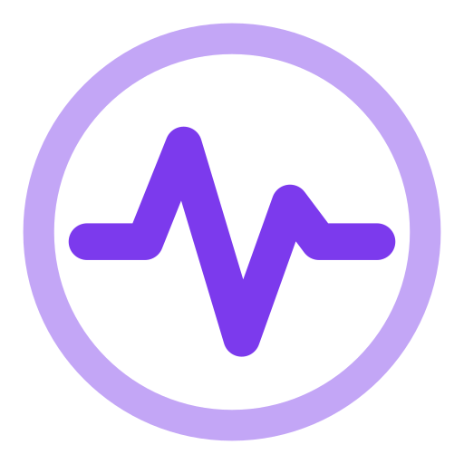
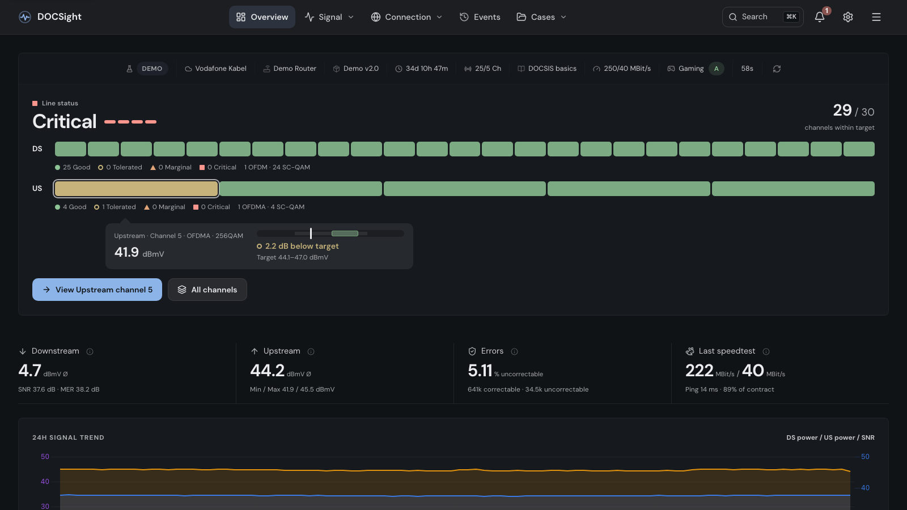
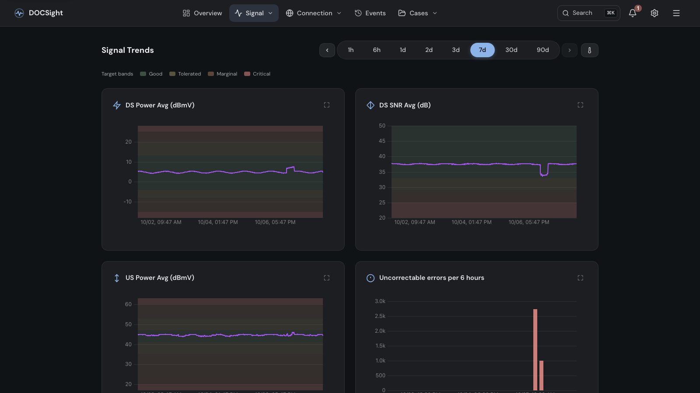
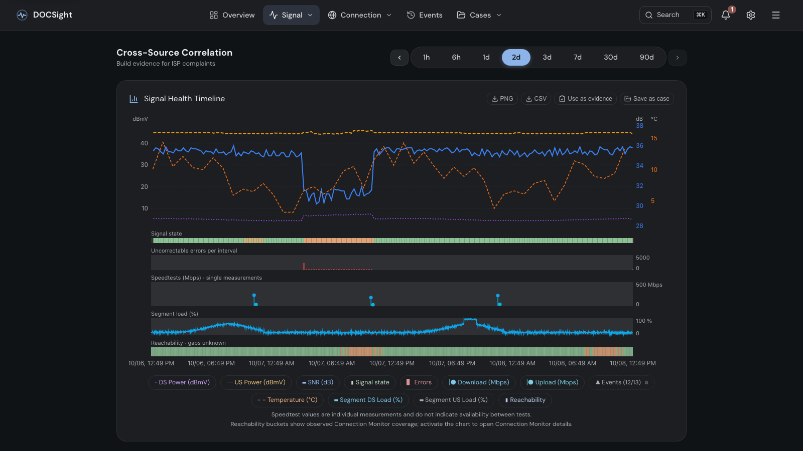
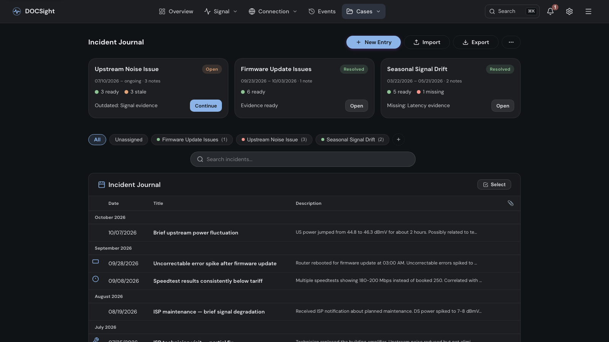
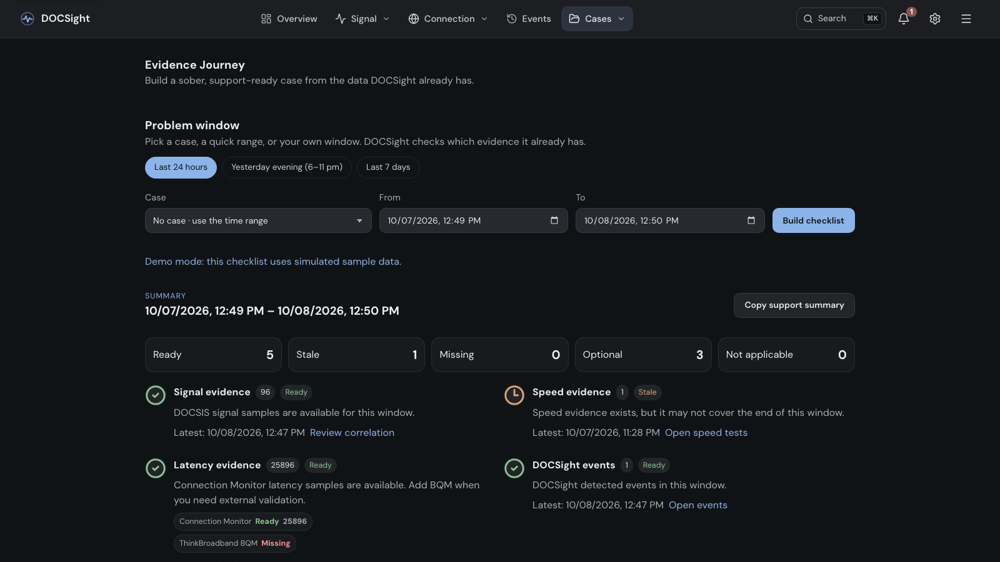

<p align="center">
  
</p>

<h1 align="center">DOCSight</h1>

<p align="center">
  <strong>Your ISP says everything is fine. DOCSight shows the timeline.</strong>
</p>

<p align="center">
  Self-hosted monitoring for your internet connection. DOCSight keeps DOCSIS signal history, speed tests, latency, events and notes together, so you can find out what is wrong and prove it to your provider.
</p>

<p align="center">
  <a href="#get-started">Get started</a>&nbsp;&nbsp;&bull;&nbsp;&nbsp;
  <a href="https://itsdnns.github.io/docsight/">Product page</a>&nbsp;&nbsp;&bull;&nbsp;&nbsp;
  <a href="https://github.com/itsDNNS/docsight/wiki">Wiki</a>&nbsp;&nbsp;&bull;&nbsp;&nbsp;
  <a href="#supported-hardware">Supported hardware</a>&nbsp;&nbsp;&bull;&nbsp;&nbsp;
  <a href="https://github.com/itsDNNS/docsight/releases">Releases</a>&nbsp;&nbsp;&bull;&nbsp;&nbsp;
  <a href="CODE_SIGNING.md">Code signing</a>
</p>

<p align="center">
  <a href="LICENSE"></a>
  <a href="https://github.com/itsDNNS/docsight/releases/latest"></a>
  <a href="https://github.com/itsDNNS/docsight/stargazers"></a>
  <a href="https://github.com/itsDNNS/docsight/pkgs/container/docsight"></a>
  <a href="https://selfh.st/weekly/2026-02-27/"></a>
</p>

<picture>
  <source media="(prefers-color-scheme: light)" srcset="docs/screenshots/dashboard-light.png">
  
</picture>

<p align="center"><sub>The real interface with synthetic demo data.</sub></p>

## Get started

Try the demo, no modem required:

```bash
docker run -d --name docsight-demo -p 8765:8765 -e DEMO_MODE=true ghcr.io/itsdnns/docsight:stable
```

Connect your own modem or router:

```bash
docker run -d --name docsight --restart unless-stopped -p 8765:8765 -v docsight_data:/data ghcr.io/itsdnns/docsight:stable
```

Open `http://localhost:8765` and follow the setup. It asks for your connection type, finds the modem on request and tests the connection. Configuration and history stay in the `docsight_data` volume. `stable` follows releases; `latest` follows the `main` branch.

[Installation guide](https://github.com/itsDNNS/docsight/wiki/Installation) · [Docker Compose](docker-compose.yml) · [Windows quick start](https://github.com/itsDNNS/docsight/wiki/Windows-Quick-Start) · [Windows Desktop Preview](https://github.com/itsDNNS/docsight/wiki/Windows-Desktop-Preview) · [Running without Docker](https://github.com/itsDNNS/docsight/wiki/Running-without-Docker)

## Detect, understand, prove

| Find the pattern | Connect the signals |
|---|---|
|  |  |
| Signal history with target bands. Step back in time, or click a point to open the full snapshot. | Signal, errors, speed tests, segment load and reachability on one timeline. |

| Collect it in a case | Bring it to your provider |
|---|---|
|  |  |
| Cases gather events, notes and snapshots, and show which evidence is ready. | The Evidence Journey checks a window and builds the report, letter and PDF. |

## Features

- **Signal:** [Home with line status](https://github.com/itsDNNS/docsight/wiki/Features-Dashboard), [Signal Trends](https://github.com/itsDNNS/docsight/wiki/Features-Signal-Trends), [Channels and Channel Timeline](https://github.com/itsDNNS/docsight/wiki/Features-Channel-Timeline), [Modulation](https://github.com/itsDNNS/docsight/wiki/Features-Modulation-Performance), [Cable Segment Utilization](https://github.com/itsDNNS/docsight/wiki/Features-Segment-Utilization), [Correlation](https://github.com/itsDNNS/docsight/wiki/Features-Correlation-Analysis)
- **Connection:** [Connection Monitor](https://github.com/itsDNNS/docsight/wiki/Features-Connection-Monitor) with outages and traceroutes, [Speedtest Tracker](https://github.com/itsDNNS/docsight/wiki/Features-Speedtest), [BQM](https://github.com/itsDNNS/docsight/wiki/Features-BQM), [Smokeping](https://github.com/itsDNNS/docsight/wiki/Features-Smokeping), [Gaming Quality](https://github.com/itsDNNS/docsight/wiki/Features-Gaming-Quality)
- **Events and cases:** [Event Log](https://github.com/itsDNNS/docsight/wiki/Features-Event-Log), [Incident Journal and cases](https://github.com/itsDNNS/docsight/wiki/Features-Incident-Journal), [Evidence Journey](https://github.com/itsDNNS/docsight/wiki/Features-Evidence-Journey), [Before/After](https://github.com/itsDNNS/docsight/wiki/Features-Before-After-Comparison), [Smart Capture](https://github.com/itsDNNS/docsight/wiki/Features-Smart-Capture), [complaint letters](https://github.com/itsDNNS/docsight/wiki/Filing-a-Complaint), [BNetzA measurements](https://github.com/itsDNNS/docsight/wiki/Features-BNetzA) and [TKG compensation](https://github.com/itsDNNS/docsight/wiki/Features-TKG-Compensation) for Germany
- **Platform:** [Home Assistant](https://github.com/itsDNNS/docsight/wiki/Home-Assistant), [notifications](https://github.com/itsDNNS/docsight/wiki/Notifications) including browser push, [backup and restore](https://github.com/itsDNNS/docsight/wiki/Backup-and-Restore), [themes](https://github.com/itsDNNS/docsight/wiki/Themes), [community modules](https://github.com/itsDNNS/docsight-modules), [AI export](https://github.com/itsDNNS/docsight/wiki/Features-LLM-Export) with local redaction, 24 languages, installable as an app

See the [sample complaint report](docs/samples/demo-complaint-report.pdf) and the [proof pack](https://github.com/itsDNNS/docsight/wiki/Proof-Pack) for an example with synthetic data.

## Your data stays with you

History and reports stay on your own hardware. Optional integrations only talk to the services you configure. Review exports before you share them: they can contain connection details and notes. See the [data contract](DATA_CONTRACT.md) and the [security policy](SECURITY.md).

## Supported hardware

DOCSight has drivers for **22 modem families**, among them AVM FRITZ!Box Cable, Vodafone Station (CGA4233, TG3442DE), Sercomm Ultra Hub 7, Connect Box (CH7465), Sagemcom F@st 3896 and F3896LG, [PYUR FAST3896-15](https://github.com/itsDNNS/docsight/wiki/Modem-PYUR-FAST3896-15) (experimental), Technicolor TC4400, Arris SURFboard, Hitron CODA and Netgear CM1000/CM3000. See [supported modems](https://github.com/itsDNNS/docsight/wiki/Supported-Modems) for the full list and setup notes.

Not on cable? **Generic Router mode** works with fiber, DSL and satellite: speed tests, latency monitoring, notes and reports, without DOCSIS signal data. Community drivers live in [docsight-modules](https://github.com/itsDNNS/docsight-modules); you can also [add your own modem](https://github.com/itsDNNS/docsight/wiki/Adding-Modem-Support).

## Community and support

Ask questions in [GitHub Discussions](https://github.com/itsDNNS/docsight/discussions/categories/q-a), and see [SUPPORT.md](SUPPORT.md) for troubleshooting and bug reports. Contributions are welcome; please read [CONTRIBUTING.md](CONTRIBUTING.md) and open an issue or idea discussion before you start on a new feature.

If DOCSight helps you, you can support its development through [GitHub Sponsors](https://github.com/sponsors/itsDNNS), [Ko-fi](https://ko-fi.com/itsdnns) or [PayPal](https://paypal.me/itsDNNS).

## License and brand

The code is [MIT-licensed](LICENSE). The DOCSight name and logo are covered by the [brand policy](TRADEMARKS.md): forks may say they are "based on DOCSight", but not present themselves as the official project.

<p align="center">
  <sub><strong>DOCSight</strong> = <strong>DOCS</strong>IS + In<strong>sight</strong> (+ a quiet <em>sigh</em> from every cable internet user)</sub>
</p>
