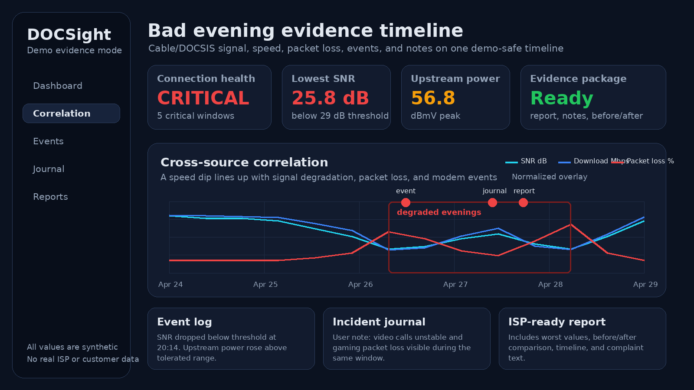

# DOCSight public proof pack

This page collects demo-safe assets for README, launch posts, community replies, and support docs. Everything here uses synthetic data. Do not replace these files with screenshots from a real connection unless all personal and network data is removed.

## Ready-to-use assets

Live community threads:

- [Share your DOCSight setup and what it helped you prove](https://github.com/itsDNNS/docsight/discussions/343)
- [Supported modem reports](https://github.com/itsDNNS/docsight/discussions/454)
- [ISP evidence outcomes](https://github.com/itsDNNS/docsight/discussions/455)

### Bad evening evidence timeline



Use this when the story is about intermittent cable problems, cross-source correlation, or the evidence workflow.

What it proves:

- DOCSight can put signal health, speed, packet loss, events, notes, and reporting into one timeline.
- The product is about recurring patterns, not a single modem screenshot.
- The public demo can show a clear problem case without exposing a real ISP, address, IP, MAC, customer number, or ticket.

Best placements:

- README proof section
- launch posts
- Show HN or self-hosted community posts
- replies where someone asks how DOCSight differs from a speedtest dashboard

### Germany-oriented demo complaint report

[Download the demo complaint report](samples/demo-complaint-report.pdf)

Use this when the claim is about report output, complaint preparation, or before/after evidence. The sample uses synthetic data with `Example Cable Provider` and `Demo DOCSIS Gateway`, but it intentionally keeps the app's current Germany/VFKD threshold references and complaint wording. Treat it as a public-safe product output sample, not as universal legal or regulatory guidance.

What it proves:

- DOCSight can turn collected measurements into a PDF report.
- The report contains current status, worst values, threshold references, and complaint-ready text.
- The sample is safe to share because it uses synthetic connection data, `Example Cable Provider`, and `Demo DOCSIS Gateway`.

## Claim to proof mapping

### Your ISP says everything is fine. DOCSight shows the timeline.

Proof assets:

- `docs/screenshots/bad-day-evidence.png`
- `docs/samples/demo-complaint-report.pdf`
- `docs/screenshots/social-preview.png`
- `docs/screenshots/complaint-workflow.png`

Use when:

- launching DOCSight
- explaining why a long-running timeline matters
- showing the difference between a symptom and a case file

### Speedtest is not enough

Proof assets:

- `docs/screenshots/bad-day-evidence.png`
- `docs/screenshots/speedtest.png`
- `docs/screenshots/social-preview.png`

Use when:

- comparing DOCSight with speedtest history tools
- explaining correlation between speed dips and cable signal health
- discussing gaming, video calls, or intermittent evening slowdowns

### Local-first evidence workflow

Proof assets:

- README privacy section
- architecture section
- demo screenshot disclosure text
- sample report generated locally

Use when:

- posting to self-hosted communities
- discussing privacy
- explaining why connection history should stay on the user's machine

## Public screenshot safety checklist

Before adding a screenshot to README, docs, release notes, or social posts, check for:

- no real ISP account number, customer number, ticket ID, address, name, or phone number
- no public IP, private IP, MAC address, serial number, Wi-Fi SSID, hostname, or precise location
- no browser profile avatar, bookmarks, notification center, OS username, or devtools panel
- no localhost-only error page, stack trace, debug banner, or test fixture wording that looks broken
- no third-party brand shown unless it is necessary and factual
- no legal or regulatory promise such as "guaranteed complaint success" or "certified proof"

Preferred public labels:

- `Example Cable Provider`
- `Demo DOCSIS Gateway`
- `Demo evidence mode`
- `Synthetic data`

Avoid:

- real provider names in hero screenshots unless the page is specifically about that provider
- screenshots that show mostly healthy values when the message is about proving a fault
- filled complaint forms with personal data, even fake-looking data that could be mistaken for real data

## Shot list for future assets

These assets would further strengthen the proof pack:

1. **Report preview screenshot**
   - Show the first page of the demo complaint report in the app or browser.
   - Keep `Example Cable Provider` and synthetic values visible.

2. **Before and after technician visit**
   - Period A: repeated critical evening windows.
   - Period B: stable signal after the fix.
   - Show the verdict and the delta values.

3. **Speedtest-only versus DOCSight**
   - Left: a speed dip chart by itself.
   - Right: speed dip plus SNR, upstream power, packet loss, event log, and journal note.

4. **Privacy/local-first architecture**
   - Show modem/router, DOCSight container, SQLite storage, optional Home Assistant/MQTT, optional exports.
   - Keep the message simple: data stays local unless the user exports it.

5. **Community proof story**
   - Redacted user setup, problem tracked, evidence used, what changed.
   - Use a real story only after explicit permission and redaction.

## Regenerating the bundled assets

From the repository root:

```bash
uv run --with fpdf2 --with pillow --with flask --with cryptography --with requests --with beautifulsoup4 python scripts/generate_marketing_proof_pack.py
```

Generated files:

- `docs/screenshots/bad-day-evidence.png`
- `docs/screenshots/dashboard-hero.png`
- `docs/screenshots/social-preview.png`
- `docs/samples/demo-complaint-report.pdf`

The generator uses synthetic data only and should stay that way.
